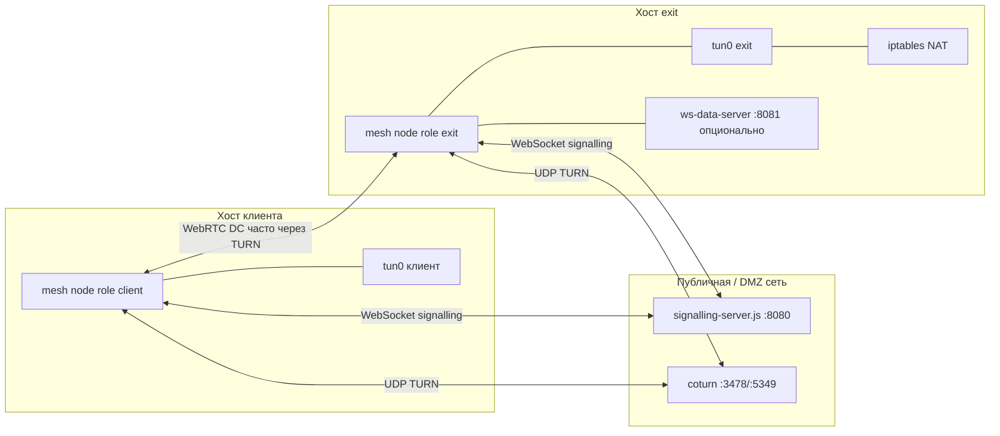
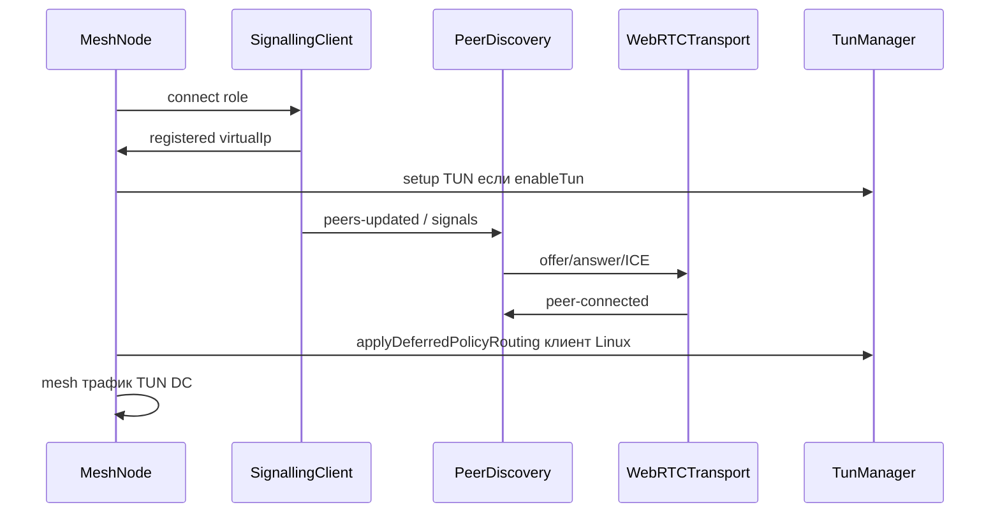

# Mesh VPN — полная суммаризация проекта (для людей и LLM-агентов)

Документ описывает назначение репозитория, требования, развёртывание, потоки данных, основные модули, известные проблемы и что уже пробовали чинить. Цель — чтобы новый разработчик или агент мог продолжить работу без догадок.

---

## 1. Краткое назначение

**Mesh VPN** — децентрализованная overlay-сеть поверх **WebRTC** (и опционально QUIC/WebSocket), с **onion-шифрованием** пакетов по пути, **маршрутизацией** к exit-нодам и **TUN-интерфейсом** на клиенте и exit для интеграции с IP-стеком ОС.

- Клиент поднимает **TUN**, кладёт в mesh **IPv4-пакеты** из ОС; они шифруются, идут по цепочке узлов, на **exit** вынимаются из onion и **инжектируются в TUN exit**, откуда **NAT** отправляет их в интернет.
- **Signalling** (отдельный WebSocket-сервер) только для обмена SDP/ICE и списка пиров; **медиаплоскость** — WebRTC DataChannel (UDP, часто через **TURN**).

Стек: **Node.js ≥ 18**, **node-datachannel** (libdatachannel), **ws**, криптография **@noble/curves** / **@noble/hashes**.

---

## 2. Требования и ограничения

| Требование | Детали |
|------------|--------|
| ОС | Linux и macOS (TUN через helper: `helpers/tun-helper` Linux, `utun-helper` macOS) |
| Права | `sudo` для TUN, `ip`/`iptables` на Linux-клиенте с full tunnel |
| Сеть | Доступность **signalling** (TCP 8080 по умолчанию), **TURN/STUN** с клиента и exit |
| Идентичность | Ed25519; ключи в `~/.mesh-vpn/identity-<role>.key` если не задан `privateKey` |
| Виртуальная сеть | По умолчанию **10.200.0.0/16**, IP выдаёт signalling при регистрации |

Ограничения:

- Документированная схема **Linux policy routing + split-default** ориентирована на **IPv4**.
- **Один процесс Node** совмещает **WebRTC**, **чтение TUN** и **выполнение `ip`/`iptables`** — это важно для понимания гонок с маршрутизацией (см. раздел 12).

---

## 3. Где какие компоненты поднимаются

| Компонент | Типичное размещение | Файл / конфиг |
|-----------|---------------------|---------------|
| Signalling | VPS или тот же хост, что exit; **должен быть достижим с client и exit** | `server/signalling-server.js`, порт из конфига |
| TURN (coturn) | Публичный IP; **должен быть доступен с обеих сторон** | `turnServers` в JSON, см. `server/turn-setup.md` |
| Client | Рабочая станция, VPS с Linux | `config/client-node.json`, `--role client` |
| Exit | Сервер с исходящим интернетом | `config/exit-node.json`, `--role exit`, `sudo` |
| Relay / client-relay | Промежуточные узлы | `relay-node.json`, `client-relay.json` |

**Важно для exit:** если signalling на другой машине, в конфиге exit **нельзя** `ws://localhost:8080` — нужен публичный URL (см. предупреждение в `src/index.js`).

**dataServer:** опциональный **WebSocket data server** на exit (`dataServerPort`, например 8081) — **не** путать со signalling. Клиент может иметь `dataServer` URL на этот порт для альтернативного транспорта (в конфиге примера указан ws на exit).

---

## 4. Загрузка конфигурации

Порядок слияния (см. `src/index.js` → `loadConfig`):

1. `config/default.json` **или** `./config.json` **или** `~/.mesh-vpn/config.json` (первый найденный)
2. `config/<role>-node.json` (например `client-node.json`, `exit-node.json`) поверх
3. Аргументы CLI (`--signalling`, `--role`, `--key`, …) поверх файлов. **`--config` / `-c`** парсится, но **JSON по этому пути не подгружается** — в `config` попадает лишь строковое поле `configPath`; для отдельного файла нужно расширить `src/index.js` или копировать поля в `config/<role>-node.json`.
4. `signallingServer` по умолчанию: `SIGNALLING_SERVER` или `ws://localhost:8080`

`transport` может быть строкой (`"webrtc"`) или объектом с `preferredOrder: ["webrtc","quic","websocket"]` (см. `MeshNode` в `src/core/node.js`).

---

## 5. Поток жизни узла (высокий уровень)

1. **`node.start()`** — discovery подключается к signalling, регистрация, получение virtual IP.
2. **TUN** — после `registered` на client/exit (см. обработчики в `src/core/node.js`).
3. **PeerDiscovery** — по списку пиров инициирует WebRTC (кто с меньшим `nodeId` — offerer для чистого WebRTC), обмен session keys, SDP, trickle ICE.
4. **TransportManager** — мультиплекс: WebRTC / QUIC / WebSocket; для mesh обычно WebRTC DC.
5. **Сообщения по DC** — фреймы с onion-пакетами; **MeshNode** парсит IP, маршрутизирует, шифрует слоями.

---

## 6. Ответственность модулей (карта репозитория)

| Путь | Ответственность |
|------|-----------------|
| [`src/index.js`](src/index.js) | Точка входа, загрузка конфига, identity, создание `MeshNode`, SIGINT |
| [`src/core/node.js`](src/core/node.js) | Оркестрация: TUN, discovery, transport, router, NAT exit, keepalive, deferred policy routing на peer-connected |
| [`src/core/router.js`](src/core/router.js) | Граф топологии, поиск пути к exit, onion wrap |
| [`src/core/graph.js`](src/core/graph.js) | Узлы/рёбра топологии |
| [`src/core/scheduler.js`](src/core/scheduler.js) | Multipath scheduler |
| [`src/control/discovery.js`](src/control/discovery.js) | Signalling-события, WebRTC offer/answer, **hsGen** для trickle ICE, mesh reconnect, очередь async work |
| [`src/control/signalling.js`](src/control/signalling.js) | WebSocket клиент к серверу, ping, topology |
| [`src/transport/manager.js`](src/transport/manager.js) | Выбор транспорта, делегирование в webrtc/quic/ws |
| [`src/transport/webrtc.js`](src/transport/webrtc.js) | **node-datachannel** PeerConnection, ICE, DC, **tearDown** при failed, очередь remote ICE до setRemoteDescription |
| [`src/network/tun.js`](src/network/tun.js) | Linux/macOS TUN, **policy routing**, infra /32, split-default, `[TUN-DIAG]`, отложенный split |
| [`src/network/linux-rp-filter.js`](src/network/linux-rp-filter.js) | `rp_filter=2` для uplink/tun |
| [`src/crypto/*`](src/crypto/) | Identity Ed25519, сессии X25519, AES-GCM, onion |
| [`src/exit/nat-manager.js`](src/exit/nat-manager.js) | Системный NAT Linux |
| [`src/workers/pipeline.js`](src/workers/pipeline.js) | Опциональные worker threads для TX/RX |
| [`server/signalling-server.js`](server/signalling-server.js) | Регистрация узлов, ретрансляция сигналов |

---

## 7. Signalling (протокол на уровне идей)

- Клиенты подключаются WebSocket к signalling, отправляют `register`, получают `registered` с **virtualIp**.
- Сервер рассылает **список пиров**, **exit nodes**, **topology**.
- Сообщения **`signal`** несут типы: `offer`, `answer`, `ice-candidate`, `session-key`, … между парами nodeId.

Подробности реализации — в `signalling-server.js` и `signalling.js`.

---

## 8. WebRTC и ICE

- Библиотека: **node-datachannel** (не werift — README ранее мог устареть).
- Режимы: `iceMode` (`auto` / `relay` / `direct`), `dcMode` (`reliable` / `performance`).
- **Relay-only** (`iceMode: relay`): в конфиге часто только TURN; STUN из списка может фильтроваться в `convertIceServers`.

### 8.1 Известные правки в этой ветке работ

1. **hsGen / trickle order** (`discovery.js`): раньше отбрасывался любой ICE с `hsGen !== expected`; при reconnect trickle нового handshake приходил **до** offer → ложный «stale». Исправление: дроп только при **`hsGen < exp`**, при **`hsGen > exp`** обновление expected и forward; при **peer-disconnected** сброс `_expectedRemoteIceHsGen`.

2. **«without ICE transport»** (`webrtc.js`): после failed оставался мёртвый PC, но `_remoteDescForTrickle` оставался true → trickle до нового offer бился в мёртвый PC. Исправление: **синхронный tearDown** при `state failed/closed` + fallback в `addIceCandidate` при ошибке libdatachannel.

3. **Гонка TUN vs WebRTC** (`node.js` + `discovery.js`): барьер **`awaitTunBeforeMesh`** — mesh-handshake не стартует, пока не завершён первичный `tunManager.setup`.

4. **Linux TUN** (`tun.js`): **ранняя фаза** — infra /32 + table 100 + mesh /16 **до** полного split-default; split **`0.0.0.0/1` + `128.0.0.0/1`** откладывается до `peer-connected` + `deferPolicyRoutingDelayMs`; опция **`linuxSplitDefaultDelayAfterPeerMs`**; **`cancelDeferredSplitDefaultTimer`** на disconnect; расширение **`logRouteDiagSs`**.

---

## 9. TUN и Linux full tunnel (детально)

См. также [`docs/linux-client-routing.md`](docs/linux-client-routing.md).

- **Фаза A:** поднять интерфейс, маршрут mesh `10.200.0.0/16` на tun; при deferred full tunnel — собрать infra IPv4 (signalling, TURN, STUN DNS, excludeFromVPN), применить **без** split `/1` (ранний bypass).
- **Фаза B:** после `peer-connected` (для WebRTC с задержкой `deferPolicyRoutingDelayMs`) — добросать split-default при `linuxSplitDefault !== false`, DNS при `dnsViaVpn`, опционально flush route cache.

**Цель split /1:** перенаправить «обычный» IPv4 трафик приложений ОС в TUN → mesh → exit → NAT.

**Инфра /32 в main:** более специфичные маршруты, чем /1, чтобы **TURN/STUN/signalling** шли через **uplink**, не в tun.

**Таблица 100 + fwmark:** обход туннеля для SSH (mangle MARK только TCP 22), не маркировать UDP TURN (комментарий в коде: MARK ломает ICE).

---

## 10. Текущая нерешённая проблема (full tunnel + WebRTC)

### Симптом

На **Linux-клиенте** с **`linuxSplitDefault: true`** (маршруты `0.0.0.0/1` и `128.0.0.0/1` на tun0 после фазы B):

- WebRTC доходит до **`ICE: completed`**, DataChannel открыт, **Peers: 1**.
- Через примерно **30–60 секунд** после применения split-default — **`PC state: failed` / `closed`** на **клиенте и exit одновременно**.
- **`ip route get <TURN_IP>`** часто показывает **корректный путь через eth0** и до, и после обрыва — то есть **статическая таблица main «правильная»**, но ICE всё равно падает.

### Что пробовали

- Отключить **`ip route flush cache`** (`linuxFlushRouteCache: false`) — **не устранило**.
- Ранняя infra **без** split до peer; split после задержки — **корреляция с падением сохраняется** при включённом split.
- Отдельная задержка **`linuxSplitDefaultDelayAfterPeerMs`** — пользователь сообщал, что **стабильности не дало** в их прогонах.
- Исправления signalling (hsGen, tearDown PC, очередь ICE) — убрали **ложные reconnect** и ошибки «without ICE transport», но **первичный обрыв после split** остаётся.

### Почему ассистент/код «не смогли добить»

1. **Недостаточно данных ядра:** один `ip route get` к адресу TURN не описывает поведение **уже созданных UDP-сокетов**, conntrack, asymmetric routing, взаимодействие с **rp_filter** и изменением **policy** в момент появления /1-маршрутов.
2. **Один процесс:** WebRTC и маршрутизация в одном address space; воспроизведение зависит от **VPS/ядра/версии node-datachannel** — без доступа к хосту агент опирается только на логи.
3. **Нет автоматического tcpdump/conntrack** в CI; ручные шаги пользователь выполнял не всегда в нужное окно.

**Требование владельца проекта:** целевой режим — **full tunnel со split-default** (`linuxSplitDefault: true`). Отключение split-default только ради стабильности WebRTC **не считается приемлемым постоянным решением**; его можно использовать лишь как диагностический контрольный прогон.

### Направления для следующих итераций (не реализованы как «готовое решение»)

- Изолировать WebRTC в **отдельный network namespace** или **отдельный процесс** с «чистой» таблицей маршрутов, оставив TUN/policy в другом контексте.
- Системный **сетевой** full tunnel (WireGuard и т.д.) поверх или вместо split в том же процессе — иначе архитектурно развести **control plane** и **default route hijack**.
- Углублённый захват пакетов **до/после** split на интерфейсе к TURN и сравнение с **coturn** логами (allocation lifetime, permissions).

---

## 11. Входные и выходные интерфейсы системы

| Интерфейс | Направление | Описание |
|-----------|-------------|----------|
| OS → Client | Вход | IPv4 пакеты в **TUN** (`/dev/net/tun` через helper) |
| Client → Mesh | Выход / вход | Зашифрованные кадры по **WebRTC DataChannel** к следующему хопу |
| Mesh → Exit | Вход | Onion-слои снимаются на пути |
| Exit → OS | Выход | Декапсулированный IP в **TUN exit** → **FORWARD** + **MASQUERADE** |
| Internet → Exit | Вход | Ответы приходят на NAT, обратно в TUN |
| Exit → Client | Выход / вход | Обратный путь через mesh, onion, DC |
| Client → OS | Выход | Пакеты пишутся в TUN клиента |
| Signalling | Двунаправленно | WebSocket JSON: регистрация, пиры, SDP, ICE |
| TURN | Двунаправленно | UDP (и TLS для turns) для relay-кандидатов |

---

## 12. Чеклист для следующего агента

1. Прочитать этот файл и [`docs/linux-client-routing.md`](docs/linux-client-routing.md).
2. Трассировка клиента: [`src/core/node.js`](src/core/node.js) (`peer-connected`, `awaitTunBeforeMesh`, deferred routing), [`src/network/tun.js`](src/network/tun.js) (фазы A/B, таймеры split).
3. WebRTC: [`src/transport/webrtc.js`](src/transport/webrtc.js), ICE: [`src/control/discovery.js`](src/control/discovery.js) (`hsGen`, trickle).
4. Конфиги: [`config/client-node.json`](config/client-node.json), [`config/exit-node.json`](config/exit-node.json) — **пример в репозитории может отличаться от дефолтов в коде** (`tun.js` задаёт свои default для отдельных ключей).
5. При отладке обрыва: логи `[TUN-DIAG]`, `linuxFlushRouteCache`, tcpdump на uplink к IP TURN, логи coturn, сравнение времени с моментом фазы B.

---

## 13. Документация и вспомогательные файлы

| Файл | Назначение |
|------|------------|
| [`README.md`](README.md) | Быстрый старт, ссылки, обзор |
| [`docs/linux-client-routing.md`](docs/linux-client-routing.md) | Фазы A/B, параметры tun, диагностика |
| [`server/turn-setup.md`](server/turn-setup.md) | coturn |
| [`server/nat-setup.md`](server/nat-setup.md) | NAT exit |
| [`docs/PERFORMANCE_DEBUG.md`](docs/PERFORMANCE_DEBUG.md) | Производительность |
| [`FULL_SUMMARIZATION.md`](FULL_SUMMARIZATION.md) | Этот файл |

---

## 14. Команды разработки (из package.json)

- `npm run server` — signalling
- `npm run client` / `npm run exit` / `npm run relay` — узлы (часто нужен `sudo` для TUN/NAT)
- `npm run nat:enable` / `nat:disable` — ручной NAT

---

## 15. Версия и зависимости

См. [`package.json`](package.json): **`node-datachannel`** для WebRTC, **`ws`**, **`@noble/curves`**, **`@noble/hashes`**.

---

*Последнее обновление документа: по состоянию репозитория на момент добавления FULL_SUMMARIZATION.md; при крупных изменениях кодовой базы этот файл нужно синхронизировать вручную.*
