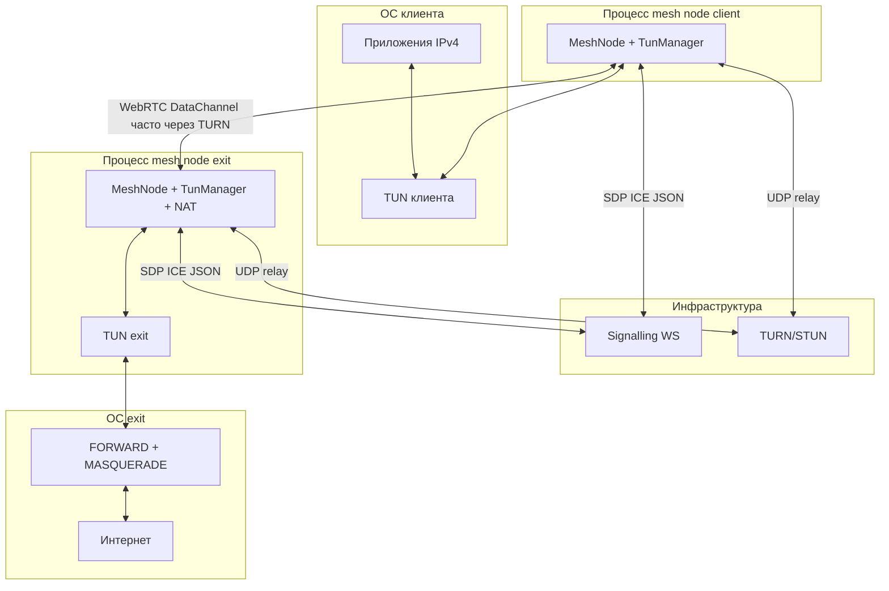

# Mesh VPN

Децентрализованная mesh VPN система с WebRTC (node-datachannel), onion-шифрованием и multipath routing.

## Run
- sudo env PATH=$PATH SIGNALLING_SERVER=62.84.
120.30:8888 npm run sig:exit
- sudo env PATH=$PATH node src/index.js --role 
client --signalling ws://62.84.120.30:8080

**Полный контекст для разработки и LLM-агентов:** [FULL_SUMMARIZATION.md](FULL_SUMMARIZATION.md) — развёртывание, потоки данных, карта модулей, известные проблемы Linux full tunnel + WebRTC.

## Схема системы (компоненты и интерфейсы)



## Быстрый пример запуска (ваши хосты)

```bash
# Signalling + exit на одной машине (пример)
sudo env PATH=$PATH SIGNALLING_SERVER=ws://62.84.120.30:8080 npm run sig:exit

# Клиент (подтянется config/client-node.json по роли client)
sudo env PATH=$PATH node src/index.js --role client --signalling ws://62.84.120.30:8080
```

Порты и URL подставьте свои; для exit на другой машине, чем signalling, **не** используйте `localhost` в URL signalling.

## Возможности

- **Mesh сеть** — все узлы связаны между собой, автоматический поиск маршрутов
- **WebRTC** — P2P соединения через NAT с помощью STUN/TURN
- **Onion encryption** — многослойное шифрование, relay узлы не видят содержимое
- **Multipath** — параллельная передача через несколько маршрутов
- **Exit nodes** — несколько выходных узлов с автоматическим failover
- **Transport fallback** — при настройке `transport.preferredOrder`: WebRTC → QUIC → WebSocket
- **Client-Relay** — комбинированная роль для одновременной работы как клиент и relay

## Кто за что отвечает (кратко)

| Часть | Роль |
|-------|------|
| [`server/signalling-server.js`](server/signalling-server.js) | Регистрация узлов, виртуальные IP, ретрансляция SDP/ICE между пирами |
| [`src/control/signalling.js`](src/control/signalling.js) + [`discovery.js`](src/control/discovery.js) | WebSocket к signalling, mesh-handshake, WebRTC offer/answer, trickle ICE |
| [`src/transport/webrtc.js`](src/transport/webrtc.js) | PeerConnection и DataChannel (libdatachannel через node-datachannel) |
| [`src/core/node.js`](src/core/node.js) | Сборка всего: TUN, маршрутизация, NAT на exit, отложенная policy routing на клиенте Linux |
| [`src/core/router.js`](src/core/router.js) | Топология, путь к exit, onion-обёртка пакетов |
| [`src/network/tun.js`](src/network/tun.js) | TUN, Linux policy routing (mesh, infra /32, split-default, SSH bypass) |
| [`src/crypto/*`](src/crypto/) | Ed25519, X25519, AES-GCM, onion |
| [`src/exit/nat-manager.js`](src/exit/nat-manager.js) | Системный NAT для выхода в интернет |

Подробнее и с известными ограничениями — [FULL_SUMMARIZATION.md](FULL_SUMMARIZATION.md).

## Логическая топология mesh

```
┌─────────────┐     ┌─────────────┐     ┌─────────────┐
│   Client    │────▶│    Relay    │────▶│  Exit Node  │────▶ Internet
│  (TUN/VPN)  │     │  (forward)  │     │   (NAT)     │
└─────────────┘     └─────────────┘     └─────────────┘
       │                   │                   │
       └───────────────────┴───────────────────┘
                    Mesh Network
```

## Быстрый старт

### Установка

```bash
npm install
```

### Запуск signalling сервера

```bash
npm run server
# или
node server/signalling-server.js
```

### Запуск клиента

```bash
npm run client
# или
node src/index.js --role client --signalling ws://localhost:8080
```

### Запуск exit node

```bash
# Запустить exit node (NAT настраивается автоматически)
sudo npm run exit

# или
sudo node src/index.js --role exit --signalling ws://localhost:8080
```

NAT включается автоматически после создания TUN интерфейса и откатывается при завершении (Ctrl+C).

Подробнее о настройке NAT: [server/nat-setup.md](server/nat-setup.md)

### Запуск relay node

```bash
npm run relay
# или
node src/index.js --role relay --signalling ws://localhost:8080
```

### Запуск client-relay node

Комбинированный режим: работает как клиент (с TUN интерфейсом) и одновременно пересылает трафик других узлов.

```bash
node src/index.js --role client-relay --signalling ws://localhost:8080
```

## Конфигурация

Файлы по умолчанию: [`config/default.json`](config/default.json) (или `config.json` / `~/.mesh-vpn/config.json`), поверх них подмешивается **`config/<role>-node.json`**, например [`config/client-node.json`](config/client-node.json), [`config/exit-node.json`](config/exit-node.json). Из CLI в итоговый объект попадают **`--signalling`**, **`--role`**, **`--key`** и т.д. Флаг **`--config` / `-c`** в справке есть, но **содержимое указанного JSON в конфиг не подмешивается** (в объекте остаётся только поле `configPath`) — для альтернативного набора настроек правьте `config/<role>-node.json` или добавьте загрузку файла в [`src/index.js`](src/index.js).

Пример фрагмента:

```json
{
  "role": "client",
  "signallingServer": "ws://localhost:8080",
  "transport": "webrtc",
  "iceServers": [
    { "urls": "stun:stun.l.google.com:19302" }
  ],
  "turnServers": [
    {
      "urls": "turn:your-turn-server:3478",
      "username": "user",
      "credential": "pass"
    }
  ]
}
```

### Переменные окружения

- `SIGNALLING_SERVER` — URL signalling сервера; для **exit** на другой машине, чем signalling, задавайте публичный `ws://host:8080`, а не `localhost`
- `NODE_ROLE` — роль узла (client/relay/client-relay/exit)

### Аргументы командной строки

```
--role, -r <role>        Роль: client, relay, exit, client-relay
--signalling, -s <url>   URL signalling сервера  
--config, -c <path>      Путь (см. ограничение выше: JSON из файла не сливается автоматически)
--key, -k <key>          Приватный ключ (base64)
```

## Настройка системы

### NAT для Exit Node

NAT настраивается **автоматически** при запуске exit node:

```bash
sudo npm run exit
```

При завершении (Ctrl+C) настройки NAT откатываются автоматически.

#### Ручное управление (fallback)

```bash
# Включить NAT (автоматически определяет ОС и интерфейс)
npm run nat:enable

# Включить NAT с указанием интерфейса
npm run nat:enable -- eth0

# Выключить NAT и восстановить исходные настройки
npm run nat:disable
```

Скрипты автоматически сохраняют исходные настройки системы в `~/.mesh-vpn-backup/` и восстанавливают их при отключении.

Подробная документация: [server/nat-setup.md](server/nat-setup.md)

### Client (Linux): full tunnel (IPv4)

При `tun.defaultRoute: true` (или если ключ не задан — по умолчанию включён) **клиент Linux** настраивает full tunnel **без** глобального правила `ip rule from all lookup 100` (оно ломало UDP/TURN при переключении маршрутизации).

Схема:

- В **`main`**: маршруты **`0.0.0.0/1`** и **`128.0.0.0/1`** на **`dev <tun>`** (весь IPv4 попадает в туннель по принципу «две половины»), маршрут к mesh **`10.200.0.0/16`**, узкие **`/32` через uplink** к IPv4 инфраструктуры (signalling/TURN/STUN/exclude) — **длиннее префикса**, чем `/1`, поэтому TURN и STUN идут мимо туннеля; маршруты к резолверам DNS (`8.8.8.8` и др.) через TUN в `main`, совместно с подменой `/etc/resolv.conf`.
- Таблица **`100`**: только **`default` через uplink** и те же **infra `/32`**, чтобы по **`ip rule fwmark 0x1 lookup 100`** обходить туннель **SSH** (и только он маркируется).
- **`iptables -t mangle`**, цепочка **`MESHVPN-BYPASS`**: маркирует исходящий TCP с `--sport 22` / `--dport 22` (conntrack), **`fwmark 0x1`** → **`lookup 100`** → физический default.

Для **доменных имён** в конфиге и в **`tun.excludeFromVPN`** выполняется DNS (`resolve4`), как раньше. Литеральные IPv4 добавляются без DNS.

Перехват DNS (`/etc/resolv.conf` и маршруты к резолверам) выполняется **только** при full tunnel на клиенте, **не** на exit-ноде.

**Порядок включения full tunnel (Linux + WebRTC):** mesh-маршрут `10.x.0.0/16` через TUN поднимается сразу; split-маршруты `0.0.0.0/1` + `128.0.0.0/1`, таблица `100`, `iptables` и подмена DNS применяются **после** первого `peer-connected` по WebRTC, с задержкой `tun.deferPolicyRoutingDelayMs` (по умолчанию 3000 ms), чтобы не гоняться с ICE/TURN. До фазы B `/etc/resolv.conf` и маршруты к публичным DNS через tun **не** трогаются. Для транспорта не WebRTC (например WebSocket) фаза B выполняется сразу при `peer-connected`.

Подробно (фазы A/B, список `ip`/`iptables`, протокол `ip route get` / tcpdump, ручные критерии приёмки): [docs/linux-client-routing.md](docs/linux-client-routing.md).

**`tun.linuxSplitDefault`:** по умолчанию **`true`** — в main добавляются обе «половины» default (`0.0.0.0/1` и `128.0.0.0/1` на TUN), и обычный интернет-трафик приложений (`curl`, браузер) уходит в туннель и дальше на exit. Если задать **`false`**, эти маршруты **не** ставятся: остаются только mesh `10.x.0.0/16` на TUN и infra `/32` на uplink — **clearnet через VPN в TUN недоступен** (трафик идёт системным default на uplink). Режим `false` полезен, когда split-default после фазы B рвёт WebRTC/TURN на том же хосте; тогда для снова полного туннеля верните `true` (или уберите ключ) и при необходимости увеличьте `tun.deferPolicyRoutingDelayMs` (например 5000–15000 ms), проверьте `tun.excludeFromVPN`, для DNS через exit включите `tun.dnsViaVpn` (и при желании `tun.deferDnsAfterPolicyMs`).

**`tun.linuxFlushRouteCache`:** по умолчанию **`true`** — после фазы B выполняется `ip route flush cache`. Если при **корректном** `ip route get` к IP TURN (uplink, не tun) ICE всё равно падает через ~30–60 с после фазы B, задайте **`false`** и проверьте стабильность (см. [docs/linux-client-routing.md](docs/linux-client-routing.md)).

**`tun.logRouteDiag`:** при **`true`** в лог печатаются блоки **`[TUN-DIAG]`** с выводом `ip route get` / `ip rule` после фазы B и при `peer-disconnected` на клиенте — можно копировать целиком без ручного запуска команд.

**Конфликты:** приоритет правила `fwmark` и mark `0x1` могут пересечься с Docker, WireGuard или другим VPN — проверьте `ip rule list` и `ip route show table 100` / `ip route show`.

**IPv6:** эта схема нацелена на **IPv4**; для SSHv6 и инфраструктуры по IPv6 нужны отдельные правила и таблицы.

### Client (macOS)

Поведение **macOS** при full tunnel **не меняется**: отдельного `ip rule`/отдельной таблицы, как в Linux, нет; используется прежняя настройка TUN-интерфейса и маршрутов через системные утилиты.

### Диагностика: клиент на VPS, exit в другой сети (Multipass, домашний NAT)

Если **signalling** на VPS, а **exit** в виртуалке/дома, типичные причины «на VPS не работают ping/curl» при full tunnel:

1. **URL signalling для exit** — внутри ВМ `localhost` — это сама ВМ, а не VPS. Задайте явно: `SIGNALLING_SERVER=ws://<PUBLIC_IP_VPS>:8080` или `node src/index.js --role exit --signalling ws://<PUBLIC_IP_VPS>:8080 -c config/exit-node-linux.json`. Предупреждение при старте `[CONFIG] Роль exit: signallingServer указывает на localhost` указывает на ту же проблему.
2. **TURN/STUN** — адреса в `turnServers` / `iceServers` должны указывать на хост, **доступный с VPS и с exit** (часто публичный IP с coturn). Замените примерные IP в конфигах на свои.
3. **Разделить mesh и policy routing** — временно `"tun": { "defaultRoute": false }` у клиента и перезапуск. Если ping/curl к интернету **снова работают**, проблема в пути **к exit в mesh** (WebRTC/TURN), а не в таблице маршрутизации 100.
4. **Логи** — при отсутствии пути к exit: `[MESH] Нет достижимого exit…` и периодически `[TUN] Нет маршрута к exit…`. Сообщение `[WS-DATA] WebSocket data server listening on port 8081` на exit относится к опциональному `dataServerPort`, это не signalling (8080).

**Проверка маршрутов (client Linux, full tunnel):** `ip route show table 100`, `ip route get <DST> table 100` — для IP TURN и нескольких IP из `dig stun.l.google.com +short` путь не должен быть через `dev tun` (кроме самого mesh). Сравните с рабочей машиной (например Multipass). Если TURN на том же хосте, что и клиент, и что-то всё ещё уходит в tun, добавьте IP в **`tun.excludeFromVPN`**.

**Hairpin / тот же VPS:** при необходимости явно согласуйте URL TURN (публичный IP vs localhost) и DNS; для теста можно временно отключить публичные STUN в конфиге (осторожно с ICE).

**Если маршруты верны, а Peers:0:** смотрите фаервол coturn, UDP, NAT на стороне exit в Multipass (`tcpdump`, логи ICE).

### Ручная настройка

#### Linux

```bash
sudo ./scripts/setup-linux.sh exit eth0
```

#### macOS

```bash
sudo ./scripts/setup-macos.sh exit en0
```

## Типы узлов

### Client

- Создает TUN интерфейс
- Генерирует VPN трафик
- Выбирает exit node
- Строит onion маршрут

### Relay

- Пересылает пакеты
- Снимает свой слой шифрования
- Не видит содержимое трафика

### Client-Relay

- Комбинация client и relay
- Создает TUN интерфейс (как client)
- Пересылает пакеты других узлов (как relay)
- Регистрируется как relay для маршрутизации
- Позволяет использовать VPN и помогать сети одновременно

### Exit Node

- Создает TUN интерфейс
- Инжектирует расшифрованные пакеты в TUN
- Использует системный NAT (iptables/pf) для выхода в интернет
- Возвращает ответы клиентам через mesh сеть

## Криптография

- **Identity**: Ed25519 — подпись и идентификация
- **Key Exchange**: X25519 ECDH — обмен ключами
- **Encryption**: AES-256-GCM — шифрование данных
- **Key Derivation**: HKDF-SHA256 — деривация ключей
- **Onion**: Многослойное шифрование по маршруту

## Виртуальная сеть

- Диапазон: `10.200.0.0/16`
- Автоматическое назначение IP при регистрации
- Маршрутизация по виртуальным IP

## TURN сервер

Подробная инструкция: [server/turn-setup.md](server/turn-setup.md)

```bash
# Ubuntu/Debian
sudo apt install coturn

# Конфигурация /etc/turnserver.conf
listening-port=3478
realm=mesh-vpn
user=meshuser:meshpass
lt-cred-mech
```

## API

### MeshNode

```javascript
import { MeshNode } from './src/core/node.js';

const node = new MeshNode({
  role: 'client',
  signallingServer: 'ws://localhost:8080'
});

await node.start();

node.on('peer-connected', (peerId) => {
  console.log('Connected:', peerId);
});

node.on('registered', (info) => {
  console.log('Virtual IP:', info.virtualIp);
});
```

### Identity

```javascript
import { Identity } from './src/crypto/index.js';

const identity = new Identity();
console.log('Node ID:', identity.nodeId);
console.log('Public Key:', identity.exportPublicKey());

// Подпись
const signature = identity.sign('message');

// Верификация
Identity.verify('message', signature, identity.publicKey);
```

## Структура проекта

```
mesh-vpn/
├── src/
│   ├── index.js              # Entry point
│   ├── core/
│   │   ├── index.js          # Module exports
│   │   ├── node.js           # MeshNode class
│   │   ├── router.js         # Mesh routing
│   │   ├── scheduler.js      # Multipath scheduler
│   │   └── graph.js          # Network topology
│   ├── crypto/
│   │   ├── index.js          # Module exports
│   │   ├── identity.js       # Ed25519 keys
│   │   ├── session.js        # X25519 key exchange
│   │   ├── encrypt.js        # AES-256-GCM
│   │   └── onion.js          # Onion encryption
│   ├── transport/
│   │   ├── index.js          # Module exports
│   │   ├── manager.js        # Transport abstraction
│   │   ├── webrtc.js         # WebRTC (node-datachannel / libdatachannel)
│   │   ├── quic.js           # QUIC fallback
│   │   ├── websocket.js      # WebSocket fallback
│   │   ├── ws-data-server.js # Опциональный data server на exit
│   │   └── send-buffer.js
│   ├── network/
│   │   ├── index.js          # Module exports
│   │   ├── tun.js            # TUN interface (Linux/macOS), policy routing
│   │   ├── linux-rp-filter.js
│   │   ├── packet.js         # IP packet parsing/building
│   │   ├── batcher.js
│   │   └── ip-manager.js     # Virtual IP manager
│   ├── workers/
│   │   ├── pipeline.js
│   │   ├── tx-worker.js
│   │   └── rx-worker.js
│   ├── debug/
│   │   ├── index.js
│   │   └── metrics.js
│   ├── control/
│   │   ├── index.js          # Module exports
│   │   ├── signalling.js     # Signalling client
│   │   └── discovery.js      # Peer discovery
│   └── exit/
│       ├── index.js          # Module exports
│       ├── nat.js            # NAT mapping table
│       ├── nat-manager.js    # Системный NAT (iptables)
│       └── userspace-nat.js
├── docs/
│   ├── linux-client-routing.md
│   └── PERFORMANCE_DEBUG.md
├── FULL_SUMMARIZATION.md     # Полная суммаризация проекта
├── server/
│   ├── signalling-server.js  # Signalling server
│   ├── turn-setup.md         # TURN server setup guide
│   └── nat-setup.md          # System NAT setup guide
├── native/
│   └── tun_linux/            # N-API TUN для scripts/clean-vpn.js (Linux); npm run build:tun-linux
├── helpers/
│   ├── tun-helper-linux.c    # userspace TUN helper (бинарь для src/ и пр.; clean-vpn.js его не использует)
│   ├── utun-helper.c         # macOS utun interface helper
│   └── Makefile              # Build helper binaries
├── config/
│   ├── default.json          # Default configuration
│   ├── client-relay.json     # Client-relay config
│   ├── exit-node.json        # Exit node config
│   └── relay-node.json       # Relay node config
└── scripts/
    ├── clean-vpn.js          # Минимальный VPN (TLS/QUIC/WebSocket/…); детали в шапке файла
    ├── probe.js              # Проверка TLS passthrough (active probing); см. ниже
    ├── nat-enable.sh         # Enable system NAT
    ├── nat-disable.sh        # Disable system NAT
    ├── setup-linux.sh        # Linux setup
    └── setup-macos.sh        # macOS setup
```

Для [`scripts/clean-vpn.js`](scripts/clean-vpn.js) на **Linux** нужен собранный модуль `native/tun_linux` (после `npm install` это делает postinstall, либо явно: `npm run build:tun-linux`; нужны python3, make, g++). `--split-default` отправляет **IPv4** default в туннель (две половины `0.0.0.0/1`), а сети **RFC1918** (`10/8`, `172.16/12`, `192.168/16`) — на uplink, чтобы локальный DNS и LAN не уходили на exit. Внешний IPv4 проверяйте так: `curl -4 https://ifconfig.me`. Для `--type=tls` и IP в `--server` см. шапку скрипта и `--tls-server-name`.

#### `--type=ws-chrome` (Puppeteer)

Трафик VPN идёт через **Headless Chrome**: на клиенте страница открывает **исходящий** WebSocket к exit (в браузере нельзя поднять WS-сервер для произвольных входящих). Зависимость: `puppeteer` (ставится с `npm install`). Свой Chrome: `--ws-chrome-executable=PATH` или `PUPPETEER_EXECUTABLE_PATH`. В Docker часто нужно `CLEAN_VPN_PUPPETEER_NO_SANDBOX=1`.

**Производительность:** по умолчанию клиент поднимает **локальный** `WebSocketServer` на `127.0.0.1` и встраивает страницу с **двумя** сокетами (exit ↔ localhost): пакеты не проходят через CDP `evaluate` / `exposeFunction`, ожидается заметно выше пропускной способности, чем у чистого CDP-пути. Медленный режим (как раньше, на каждый пакет через Puppeteer): флаг **`--ws-chrome-cdp-data`** или **`CLEAN_VPN_WS_CHROME_CDP_DATA=1`**.

- **Client + exit только WebSocket:** `exit --type=websocket`, `client --type=ws-chrome` — встроенная страница в Puppeteer, отдельный HTTP на exit не нужен.
- **Client + exit с страницей на том же порту:** `exit --type=ws-chrome` отдаёт `GET /clean-vpn-chrome` и WebSocket на upgrade. Без CDP клиент с **`--ws-chrome-exit-page`** всё равно получает тот же быстрый двойной мост через `setContent` (URL exit вшит в скрипт); загрузка HTML с exit нужна только если включён CDP (`--ws-chrome-cdp-data`) или для ручной проверки в обычном браузере. Полный URL: `--ws-chrome-url=http://HOST:PORT/clean-vpn-chrome`.
- **`--ws-chrome-url=...` (произвольная страница):** локальный мост не внедрить — используется только CDP-путь (медленнее); страница должна вызывать те же `exposeFunction`, что и встроенная (см. исходник `scripts/clean-vpn.js`).

Протокол тот же, что у `--type=websocket`: одно binary WS-сообщение = один IPv4-пакет.

**Обратный WebSocket (`--reverse`):** на VPS запускается **client**, который **слушает** `ws://` на `--server` (например `0.0.0.0:8765`); локально — **exit**, который **подключается** к `VPS:8765`. Трафик с VPS уходит в туннель, в интернет он выходит через NAT локального exit. Сейчас поддерживается только `--type=websocket`. Для `client --reverse` обязателен **`--tunnel-peer=ПУБЛИЧНЫЙ_IP`** (или hostname) машины, где запущен **exit** — так задаётся обход маршрута к пиру WebSocket (иначе при `--split-default` возможна петля). Пример: `CLEAN_VPN_REVERSE=1` эквивалентен флагу `--reverse`.

**Ubuntu ARM64 в Multipass на Mac (M1/M2/M3):** Chrome из `~/.cache/puppeteer` часто не запускается (ошибки вроде `Syntax error: ";" unexpected` у бинарника). Поставьте системный Chromium и укажите путь, либо скрипт на **arm64** сам попробует `/usr/bin/chromium-browser`, `/usr/bin/chromium`, `/snap/bin/chromium`:

```bash
sudo apt update && sudo apt install -y chromium-browser
# при необходимости явно:
sudo env PATH=$PATH node scripts/clean-vpn.js ... --type=ws-chrome --ws-chrome-executable=/usr/bin/chromium-browser
```

После неудачной загрузки можно сбросить кэш: `rm -rf ~/.cache/puppeteer`. Запуск под `sudo` уже добавляет `--no-sandbox` для Chrome.

#### `--type=rtc-chrome` (Puppeteer + WebRTC)

Только **client**. На **exit** используйте **`--type=webrtc`** (тот же WebSocket-сигналинг и Data Channel с меткой `clean-vpn`). В Headless Chrome создаётся нативный **`RTCPeerConnection`**: JSON-сигналинг на `ws://HOST:PORT/` совпадает с Node-клиентом webrtc; **IPv4-пакеты** между TUN и страницей идут через **локальный WebSocket** на `127.0.0.1` (аналогично быстрому ws-chrome), в странице они пересылаются в Data Channel. Нужны **`puppeteer`**, **`--config`** / **`--ice-mode`** (как для webrtc), опционально **`--rtc-chrome-executable=PATH`** или **`PUPPETEER_EXECUTABLE_PATH`**.

### Проверка TLS passthrough ([`scripts/probe.js`](scripts/probe.js))

Скрипт подключается к exit как обычный HTTPS-клиент (без ALPN `clean-vpn-tls`), с маркером ALPN `clean-vpn-probe`, чтобы в логах exit было `probeTool=true`. Хост в `--domain` должен совпадать с целью passthrough на exit ([`--tls-probe-target`](scripts/clean-vpn.js), по умолчанию `www.google.com:443`). Если SNI совпадает с [`--tls-public-name`](scripts/clean-vpn.js) на exit, трафик пойдёт на публичный TLS-сервер, а не в passthrough — для проверки обхода используйте другой SNI.

```bash
node scripts/probe.js --type=handshake --server=1.2.3.4:443 --domain=www.google.com:443
node scripts/probe.js --type=full --server=1.2.3.4:443 --domain=www.google.com:443 [--timeout=15000]
```

В stdout: строка `RESULT ok` или `RESULT not ok`, код выхода 0/1. На exit при passthrough пишутся строки `tls active-probe: start` и `tls active-probe: end` с IP, портом, `probeTool`, `result` и причиной.

## Требования

- Node.js >= 18
- Linux или macOS
- Root/sudo для TUN интерфейса

### clean-vpn.js: настройки ОС под нагрузку (опционально)

На Linux при высоком PPS (в т.ч. `--type=udp`, QUIC) имеет смысл поднять лимиты буферов сокетов, например:

`sudo sysctl -w net.core.rmem_max=134217728 net.core.wmem_max=134217728`

Для чистого TCP-туннеля при симптомах «узкого окна» смотрите также `net.ipv4.tcp_rmem` и `net.ipv4.tcp_wmem` (осторожно: значения зависят от сценария и политики хоста).

Если на физическом интерфейсе странная фрагментация или задержки, проверьте offload: `ethtool -k <iface>` (иногда GRO/LRO влияют на конкретный кейс).

**Будущее (не реализовано):** батч UDP на wire через `sendmmsg`/`recvmmsg` потребовал бы native-кода и, при необходимости, нового wire-формата (сейчас одна датаграмма = один IPv4-пакет).

## Лицензия

MIT
