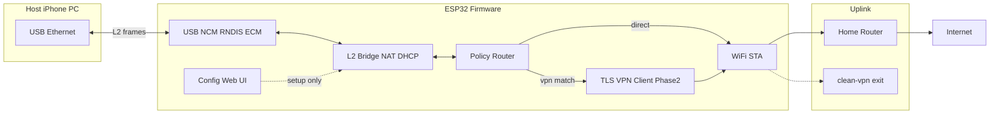
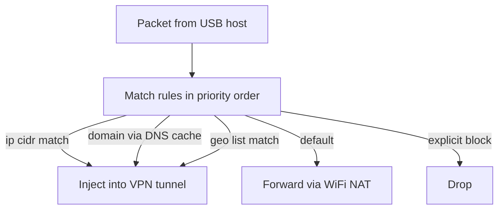

# План: USB WiFi-dongle и VPN-клиент на ESP32

## Контекст и ограничения

**Плата прототипа — [Seeed XIAO ESP32-S3](https://wiki.seeedstudio.com/xiao_esp32s3_getting_started/):**
- ESP32-S3R8: dual-core 240 MHz, 512 KB SRAM + **8 MB PSRAM**, **8 MB Flash**
- WiFi 2.4 GHz (802.11 b/g/n), BLE 5.0
- Один USB-C: OTG full-speed (12 Mbps теоретический потолок), общий PHY с USB-Serial-JTAG
- После прошивки в режиме USB-NCM **JTAG-консоль пропадает** — для отладки: UART на D6/D7 (GPIO43/44) или режим BOOT при перепрошивке

**Существующий VPN ([scripts/clean-vpn.js](../scripts/clean-vpn.js)):**
- Протокол туннеля: `[uint32 BE length][raw IPv4 packet]`
- Для embedded реалистичен только **`--type=tls` client** (TLS 1.3 + TLS exporter + Bearer HMAC + HTTP/2 POST `/clean-vpn`)
- `boring-tls`, `transparent-tls`, `combo-tls` — Linux-only (iptables, BoringSSL helper, enc-SNI) — **не целим на ESP32-S3**
- Аналог `--client-lan-subnet` на устройстве: хост за USB = «LAN», трафик SNAT/маршрутизация через uplink или VPN

**Ожидаемая скорость этапа 1:** 5–12 Mbps (USB FS + NAT на CPU). Этого достаточно для go/no-go решения.

**Будущая цель — M5Stack Stamp-P4 + Stamp-AddOn C6:**
- P4 (RISC-V 360 MHz, 32 MB PSRAM, USB 2.0 HS) + WiFi на отдельном C6 по SDIO
- Архитектура должна отделять: `board_*` (пины, USB, WiFi backend) vs `meshvpn_*` (сеть, web, VPN, routing)

---

## Целевая архитектура



### Структура репозитория (новое)

Код прошивки — в корне репозитория, рядом с `scripts/`:

```
mesh-vpn/new/
├── scripts/                    # существующий clean-vpn и утилиты
├── device/                     # ESP-IDF прошивка dongle (новое)
│   ├── CMakeLists.txt
│   ├── sdkconfig.defaults
│   ├── main/
│   ├── boards/
│   ├── profiles/
│   ├── components/
│   └── scripts/                # setup-macos.sh, flash.sh, monitor.sh
├── src/
├── native/
└── ...
```

```
device/
├── CMakeLists.txt
├── sdkconfig.defaults
├── main/
│   └── app_main.c              # init, task orchestration
├── boards/
│   ├── Kconfig                 # choice BOARD_*
│   ├── xiao_esp32s3/
│   │   ├── board.cmake
│   │   ├── sdkconfig.defaults
│   │   └── pins.h              # LED, UART debug, VBUS sense
│   └── m5_stamp_p4_c6/         # заглушка + pins, phase 3
├── profiles/
│   ├── usb_ncm.defconfig       # iPhone, современный macOS
│   ├── usb_rndis.defconfig     # Windows
│   └── usb_ecm.defconfig       # Linux, legacy macOS
├── components/
│   ├── meshvpn_board/          # board_init(), get_board_config()
│   ├── meshvpn_usb/            # TinyUSB net abstraction
│   ├── meshvpn_net/            # bridge, NAT, DHCP, DNS proxy
│   ├── meshvpn_wifi/           # STA, reconnect, scan
│   ├── meshvpn_config/         # NVS JSON schema, migration
│   ├── meshvpn_web/            # esp_http_server + REST API
│   ├── meshvpn_routing/        # policy engine (phase 1.5)
│   └── meshvpn_vpn/            # phase 2: TLS tunnel
└── scripts/
    ├── setup-macos.sh          # ESP-IDF, deps, udev не нужен
    ├── flash.sh                # одна команда прошивки
    └── monitor.sh              # UART debug
```

**Сборка:** `IDF_TARGET=esp32s3 BOARD=xiao_esp32s3 USB_PROFILE=ncm ./device/scripts/flash.sh`

---

## Этап 1: USB NIC + WiFi NAT (без VPN)

### 1.1 USB-сетевая карта для всех хостов

| Профиль | USB-класс | Хосты | Kconfig |
|---------|-----------|-------|---------|
| `ncm` | CDC-NCM | iPhone USB-C, iOS 15+ | `CONFIG_TINYUSB_NET_MODE_NCM` |
| `rndis` | RNDIS | Windows | `CONFIG_TINYUSB_NET_RNDIS` |
| `ecm` | CDC-ECM | Linux, macOS (старые) | `CONFIG_TINYUSB_NET_ECM` |

**Базовый код:** форк логики из [esp-iot-bridge wireless_nic](https://github.com/espressif/esp-iot-bridge/tree/master/examples/wireless_nic) + патчи из [ESP-IDF tusb_ncm](https://github.com/espressif/esp-idf/tree/master/examples/peripherals/usb/device/tusb_ncm) и [DrWhax/esp32-usb-wifi](https://github.com/DrWhax/esp32-usb-wifi).

**Критичные iPhone-фиксы (обязательно в `meshvpn_usb`):**
1. `tud_network_link_state(false)` сразу после init; `link up` только когда WiFi STA connected
2. В форке `esp_tinyusb`: `tud_mounted()` вместо `tud_ready()` для TX (DHCP на iOS после resume)
3. Обработка NCM OIDs: `NCM_SET_ETHERNET_PACKET_FILTER`, `NCM_SET_NTB_INPUT_SIZE` (iOS 26+, [tinyusb#3630](https://github.com/hathach/tinyusb/pull/3630))
4. DHCP relay: ESP выступает DHCP-сервером на USB-стороне (`192.168.7.0/24`, gateway `192.168.7.1` — совместимо с `--client-lan-subnet` в clean-vpn)

**Composite USB (опционально, profile `ncm+cdc`):** NCM + CDC-ACM для serial CLI без перепрошивки — полезно при разработке, но на iPhone может усложнить enumeration; для production-сборки `ncm` — только NCM.

### 1.2 Сетевой мост WiFi ↔ USB

- **WiFi:** STA mode, auto-reconnect, scan в web UI
- **NAT:** `esp_netif` + `lwip` IP forwarding + NAPT (как в esp-iot-bridge)
- **DHCP server** на USB netif для хоста
- **DNS:** проксирование DNS-запросов хоста на DNS роутера (или 1.1.1.1) — важно для будущей domain-based маршрутизации
- **MTU/MSS:** clamp MSS ~1360 (WiFi + USB overhead)

### 1.3 Минимальный Web UI для настройки

Доступ к настройкам **до** полноценного интернета:
- **Captive/setup:** при первом запуске или отсутствии WiFi creds — SoftAP `MeshVPN-Setup` + `http://192.168.4.1`
- **После настройки:** `http://192.168.7.1` с USB-интерфейса (хост уже в сети dongle)

**Стек:** `esp_http_server` + статика в `embed` / SPIFFS + REST JSON API.

**Экраны (этап 1):**
- WiFi: scan, SSID/password, сохранить
- Статус: WiFi RSSI, USB link, IP хоста, uptime, throughput counters
- Система: reboot, factory reset, смена admin password

**Экраны (заготовки под этап 2, UI сразу, backend stub):**
- VPN: server, transport type, cert upload, PSK
- Routing: правила (см. ниже)

**Хранение:** NVS namespace `meshvpn` + LittleFS partition для PEM-файлов (ca.pem, clean-vpn-hmac.key).

### 1.4 Политическая маршрутизация (заложить архитектуру, базовая реализация в 1.5)

Точка принятия решений: **каждый IPv4-пакет от USB** перед NAT/uplink.



| Тип правила | Реализация на ESP32 | Сложность |
|-------------|---------------------|-----------|
| **IP/CIDR** | Trie или sorted list, match dst/src | Низкая — этап 1.5 |
| **Domain** | DNS sniffer/proxy: при резолве домена → кэш IP→policy TTL | Средняя — этап 2 |
| **Geo** | Компактная offline DB (MaxMind GeoLite2 country → CIDR chunks, или prebuilt списки RU/US/EU) в SPIFFS | Высокая — этап 2+ |
| **Default** | `direct` или `vpn` | Этап 2 |

Конфиг правил — JSON в NVS, редактируется через web UI; применение hot-reload без reboot.

---

## Этап 2: VPN-клиент clean-vpn (после тестов этапа 1)

### Что портировать с [scripts/clean-vpn.js](../scripts/clean-vpn.js)

Минимальный client path `--type=tls`:

1. TCP connect к `server:443`
2. TLS 1.3 (mbedTLS в ESP-IDF) с verify по `ca.pem`, SNI masking (`www.google.com` при verify host `clean-vpn`)
3. **TLS exporter** RFC 5705, label `EXPORTER-clean-vpn-bind`, 32 bytes — *проверить поддержку в ESP-IDF mbedTLS; при отсутствии — wolfSSL component или патч mbedTLS*
4. Bearer: `HMAC-SHA256(PSK, "clean-vpn-tls-v2:" + exporter_hex + ":" + window)` , window = 15 мин
5. HTTP/2 client: SETTINGS → `POST /clean-vpn` + `Authorization: Bearer ...` → duplex stream
6. Framing на stream: `[u32 BE][IPv4]`
7. Интеграция: пакеты с `action=vpn` из routing engine → VPN; ответы → обратно на USB

**Библиотеки этапа 2:**
- `esp-tls` / mbedTLS — TLS
- `nghttp2` (ESP-IDF component или vendored) — HTTP/2
- Собственный `meshvpn_vpn` — state machine, reconnect, keepalive

**Нереалистично на ESP32-S3 (зафиксировать в docs):** boring-tls, transparent-tls, combo-tls, enc-SNI relay.

### Производительность VPN на S3

Ожидание: **2–8 Mbps** (TLS + HTTP/2 + single-core lwIP). Stamp-P4 с HS USB и большим PSRAM — кандидат для production, если S3 не пройдёт порог.

---

## Этап 3 (будущее): M5Stack Stamp-P4 + C6

| Аспект | XIAO ESP32-S3 | Stamp-P4 + C6 |
|--------|---------------|---------------|
| SoC | Xtensa LX7 | RISC-V P4 + C6 coprocessor |
| WiFi | On-chip | C6 via SDIO (`esp_wifi_remote` / esp-hosted) |
| USB | FS 12 Mbps | HS 480 Mbps |
| RAM | 8 MB PSRAM | 32 MB PSRAM |
| Board layer | `meshvpn_wifi` = esp_wifi | `meshvpn_wifi` = esp_hosted slave API |

Общие компоненты `meshvpn_net`, `meshvpn_web`, `meshvpn_config`, `meshvpn_routing`, `meshvpn_vpn` — без изменений; меняется только `boards/m5_stamp_p4_c6/` и WiFi backend.

---

## Dev environment на macOS (ноутбук)

### Установка (один раз) — [device/scripts/setup-macos.sh](scripts/setup-macos.sh)

```bash
# Зависимости
xcode-select --install
brew install cmake ninja dfu-util python3

# ESP-IDF v5.4+ (рекомендуется 5.4.x LTS)
mkdir -p ~/esp && cd ~/esp
git clone -b v5.4.1 --recursive https://github.com/espressif/esp-idf.git
cd esp-idf && ./install.sh esp32s3
# Добавить в ~/.zshrc:
# . ~/esp/esp-idf/export.sh
```

**Альтернатива:** Docker-образ `espressif/idf:v5.4` — если не хотите ставить toolchain локально.

### Прошивка одной командой — [device/scripts/flash.sh](scripts/flash.sh)

```bash
#!/usr/bin/env bash
# Использование:
#   ./device/scripts/flash.sh                    # defaults: xiao_esp32s3, ncm
#   ./device/scripts/flash.sh rndis             # Windows profile
#   ./device/scripts/flash.sh ecm monitor       # + serial monitor
set -euo pipefail
BOARD="${BOARD:-xiao_esp32s3}"
PROFILE="${1:-ncm}"
PORT="${PORT:-$(python3 -m serial.tools.list_ports -q | grep -i 'usbmodem\|SLAB\|wchusb\|esp32' | head -1)}"
source ~/esp/esp-idf/export.sh
cd "$(dirname "$0")/.."   # device/
idf.py -D BOARD="$BOARD" -D USB_PROFILE="$PROFILE" set-target esp32s3
idf.py -D BOARD="$BOARD" -D USB_PROFILE="$PROFILE" build flash -p "$PORT"
```

**Первая прошивка:** обычный USB-C, плата в download mode (зажать BOOT → подключить → отпустить BOOT).

**Повторная прошивка после NCM-firmware:** BOOT + подключение, или временно прошить `ncm+cdc` и смотреть логи по CDC.

**Автоопределение порта:** `esptool.py` / `idf.py` + fallback список `/dev/cu.usbmodem*`.

### npm-интеграция (опционально)

В корневой [package.json](../package.json):
```json
"scripts": {
  "device:setup": "./device/scripts/setup-macos.sh",
  "device:flash": "./device/scripts/flash.sh",
  "device:flash:rndis": "./device/scripts/flash.sh rndis"
}
```

---

## Библиотеки и ESP-IDF components

| Компонент | Назначение | Источник |
|-----------|------------|----------|
| **esp_tinyusb** | USB device stack | ESP-IDF managed |
| **espressif/iot_bridge** | NAT bridge reference | Component Registry |
| **esp_netif + lwip** | TCP/IP, NAPT | ESP-IDF |
| **esp_wifi** | WiFi STA | ESP-IDF |
| **esp_http_server** | Web UI / REST | ESP-IDF |
| **nvs_flash + cJSON** | Config persistence | ESP-IDF |
| **littlefs** | Cert storage | ESP-IDF spiffs/littlefs |
| **nghttp2** (этап 2) | HTTP/2 client | component или vendored |
| **mbedTLS** | TLS 1.3 + exporter | ESP-IDF |

---

## Порядок реализации

### Milestone A — Scaffold (1–2 дня)
- Создать `device/` tree в корне репо (рядом с `scripts/`), board Kconfig, `setup-macos.sh`, `flash.sh`
- Blink + UART log на XIAO ESP32-S3
- Документ [device/docs/xiao-esp32s3.md](docs/xiao-esp32s3.md): пины, BOOT, ограничения USB

### Milestone B — USB + WiFi bridge (3–5 дней)
- Профиль `ncm`: enumeration на iPhone
- WiFi STA hardcoded → затем из NVS
- NAT + DHCP `192.168.7.0/24`
- iPhone получает IP и выходит в интернет
- Профили `rndis`, `ecm` — smoke test на Windows VM / Linux

### Milestone C — Web UI + provisioning (2–3 дня)
- SoftAP setup flow
- REST API: wifi scan/connect, status, reboot
- Admin password, factory reset

### Milestone D — Routing foundation (2 дня)
- `meshvpn_routing`: IP/CIDR rules, default=direct
- Web UI для правил (без VPN backend)
- DNS proxy с hook для domain rules

### Milestone E — Benchmark + go/no-go (1 день)
- iperf3/speedtest через dongle, логирование CPU/RAM
- Документ с результатами и решением о этапе 2

### Milestone F — VPN client (отдельный спринт, после вашего OK)
- TLS exporter POC
- HTTP/2 tunnel
- Routing `vpn` action
- Интеграционный тест с `clean-vpn.js --role=exit`

---

## Риски и митигации

| Риск | Митигация |
|------|-----------|
| iPhone не получает IP (NCM quirks) | Патчи link-state + TinyUSB; тест на реальном iPhone USB-C |
| Потеря serial после NCM | UART debug pins; CDC composite dev build |
| Скорость < 5 Mbps | Ожидаемо для FS USB; P4 — plan B |
| TLS exporter в mbedTLS | Ранний spike в Milestone F; fallback wolfSSL |
| Stamp-P4+C6 WiFi сложность | Абстракция `meshvpn_wifi`; S3 — полнофункциональный прототип |
| Geo routing на Flash | Только country-level, сжатые списки, лимит правил |

---

## Критерии готовности этапа 1

- [ ] `./device/scripts/flash.sh` прошивает плату с macOS без ручных шагов (кроме BOOT при необходимости)
- [ ] iPhone USB-C: Settings → Ethernet появляется, DHCP, интернет работает
- [ ] Windows (`rndis`) и Linux (`ecm`): интернет через dongle
- [ ] Web UI: настройка WiFi без перепрошивки
- [ ] Throughput замерен и задокументирован
- [ ] Архитектура `boards/` + `components/` готова к VPN и P4
