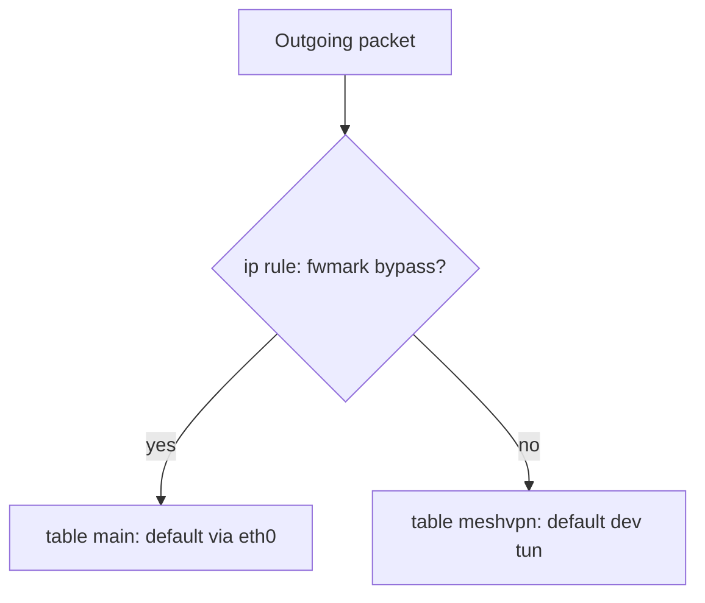

# Policy routing для full-tunnel client (Linux)

## Откат промежуточных правок (что убрать из кода вместе с внедрением policy routing)

Цель: не тащить **неработающие или вытесненные** решения той же проблемы (SSH / VPS / full tunnel) рядом с новой схемой.

**Удалить или отменить как основной механизм для Linux full tunnel:**

- Обработку **`SSH_CONNECTION`** в [`_setupDefaultRoute`](../src/network/tun.js) — частичное решение (нет переменной при systemd и т.д.), после policy routing заменяется **стабильной** маркировкой SSH-трафика.
- Целиком схему **подмены default в `main`**: `ip route del default …`, затем `default dev tun`, затем «запасной» `default … metric 1000` — её заменяет связка **отдельная таблица + `ip rule`**, без кражи default из `main`.
- Любые **не влитые / отклонённые** эвристики вроде разбора **`ss`** для пиров SSH — в репозитории не хранить.

**Пересмотреть при реализации (не дублировать два мира):**

- Сбор **IPv4 инфраструктуры из конфига** ([`collectInfraIPv4FromMeshConfigAsync`](../src/network/tun.js), [`meshVpnConfig`](../src/core/node.js)): узкие маршруты к signalling/TURN в **`main`** остаются полезными, пока этот трафик не уходит в таблицу `meshvpn`. После перехода на policy routing — либо **перенести** в явную настройку маршрутов только в `main`, либо заменить на **dst-based mark** в nft, но **не** оставлять старый «exclude пачкой /32 перед удалением default» как отдельную живую ветку.
- Жёсткий хардкод **`62.84.120.30`** в exclude: свернуть с конфигом (или один fallback), чтобы не дублировать источник истины.

**Документация:** в [README](../README.md) убрать акцент на **SSH_CONNECTION** и на «единственный спасительный» набор `/32` для SSH; описать policy routing и ручной `excludeFromVPN` только где уместно.

## Проблема текущего подхода

Сейчас в [`tun.js`](../src/network/tun.js) логика **удаляет** default из основной таблицы и ставит `default dev tun`. Тогда любой адрес без `/32` исключения уходит в tun — SSH ломается, если IP пира не угадан. Подбор пиров через `ss` при старте **не гарантирует** доступ после холодного бутa и новых сессий.

## Целевая модель (как делают зрелые VPN на Linux)

Не трогать «единственный default в `main`» в смысле **потери** нормального выхода на eth0. Вместо этого:

1. **Таблица `main`** (или текущая основная): сохранить **`default via <gw> dev <uplink>`** и при необходимости узкие маршруты к инфраструктуре (`/32` через gw) — как сейчас по смыслу, но **без** замены default на tun.
2. **Отдельная таблица маршрутизации** (например id `100`, имя `meshvpn`): в ней **`default dev tun0`** и маршрут к `10.200.0.0/16` через tun при необходимости.
3. **`ip rule`**: определить порядок выбора таблицы:
   - Пакеты с **меткой `fwmark`** (например `0x1`) — смотреть **`main`** (или явно `lookup main`), чтобы ответы SSH и прочий «исключённый» трафик шли через обычный default.
   - Остальной пользовательский трафик — **`lookup meshvpn`** (или эквивалент по приоритету), чтобы default для «всего интернета» в смысле продукта шёл в tun.

Так **новая** SSH-сессия после старта VPN получает корректные маршруты для ответов, если правила **mark** покрывают все нужные случаи (см. ниже), а не «только то, что было в `ss`».

## Маркировка трафика (netfilter)

Нужна **устойчивая** схема, не зависящая от момента старта:

- **Входящий SSH на сервер (sshd)**: для **OUTPUT** ответов связанных с локальным портом 22 — `iptables`/`nftables` **mangle**: пометить пакеты (например `-p tcp -m tcp --sport 22 -m conntrack --ctstate ESTABLISHED,RELATED -j MARK --set-mark 0x1`), плюс покрыть фазы handshake (часто достаточно расширить `ctstate` или использовать `connbytes`/`tcp-flags` по необходимости после тестов).
- **Исходящий SSH с VPS** (клиент `ssh`): маркировать OUTPUT с `--dport 22` (и при необходимости другие порты jump/bastion).
- **Инфраструктура mesh** (signalling/TURN): либо **статические `/32` в `main`** (как сейчас по смыслу), либо отдельные mark-правила — дублирования лучше избегать: **host routes в `main`** проще отлаживать.

Важно: выбрать **один** не конфликтующий `fwmark` (и при необходимости маску), задокументировать; учитывать соседство с Docker, другими VPN, wg-quick — проверять `ip rule list` и таблицы на целевой системе.

## Изменения в приложении (высокий уровень)

- В [`TunInterface`](../src/network/tun.js) (Linux) **заменить** блок `_setupDefaultRoute`, который делает `ip route del default` / `ip route add default dev tun`, на:
  - создание таблицы `meshvpn` (`/etc/iproute2/rt_tables` или числовой id + комментарий в логе);
  - заполнение маршрутов в этой таблице;
  - добавление `ip rule` с приоритетами;
  - установка iptables/nft правил mangle для mark;
  - сохранение состояния для **отката** при shutdown (снять rules, flush marks, удалить таблицу/маршруты в обратном порядке).
- **`_restoreDefaultRoute`** переписать под откат policy routing, а не только «вернуть старые строки default».
- **DNS / resolv.conf**: поведение должно остаться согласованным; при policy routing маршруты к публичным DNS через tun могут задаваться **в таблице meshvpn**, а не дублировать ломание `main` — детали согласовать с тем, резолвит ли процесс через 127.0.0.53 (systemd-resolved) или напрямую.

## Ограничения и риски

- **Только Linux** для этой схемы в полном виде; **macOS** — другой механизм (pf, `route`, нет того же `ip rule`); возможно оставить старый путь или «не full tunnel policy» на darwin.
- **IPv6**: если SSH или инфра по v6 — отдельные правила и таблицы; иначе дыры.
- **Порядок правил netfilter**: таблица `mangle` OUTPUT должна выполняться до routing; при использовании **nftables** — явная цепочка.
- **Права**: как сейчас, нужен root/sudo для `ip rule`, `iptables`/`nft`.
- **Тестирование**: сценарии — только eth0, VPS, cold boot + systemd, новая SSH-сессия после старта VPN, параллельный `curl` через tun.

## Документация

- В [README](../README.md) заменить раздел про client/Linux: убрать опору на **SSH_CONNECTION** и старую модель «смена default + исключения»; описать **policy routing** (таблица, `ip rule`, fwmark, SSH), плюс ручной `excludeFromVPN` при необходимости; конфликты с Docker/другими VPN.

## Итог

Это **нормальный** инженерный путь для full tunnel на Linux при сохранении управляемого SSH: не эвристики по процессам, а **явная** модель маршрутизации ядра + netfilter. Реализация заметно сложнее текущих `ip route add`, зато устраняет класс проблем «не было ESTAB в момент старта».
