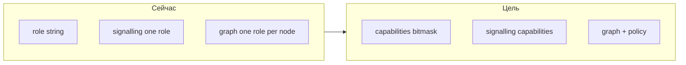

# Единая нода (client + relay + exit): анализ и риски

## Текущая модель в коде

- Один процесс = один [`Identity`](../src/core/node.js) = один `nodeId` и одна регистрация в signalling.
- Роль задаётся строкой `config.role`; флаги **`isClient`**, **`isRelay`**, **`isExit`** взаимоисключающи построены на `client` / `relay` / `exit` / `client-relay` ([`node.js`](../src/core/node.js) L18–22).
- [`PeerDiscovery.start(role)`](../src/control/discovery.js) передаёт **одну** роль в WebSocket; [`signalling-server.js`](../server/signalling-server.js) хранит у узла одно поле `role`, список exit строится по `role === 'exit'`.
- [`NetworkGraph`](../src/core/graph.js): у узла один `role`; поиск exit — [`getExitNodes()`](../src/core/graph.js), [`findPathToNearestExit`](../src/core/graph.js) (уже не считает «текущий узел как exit» в нулевом шаге, если `current === fromNodeId`).
- [`MeshRouter`](../src/core/router.js): [`findRouteToExit`](../src/core/router.js), [`exitNodePreference`](../src/core/router.js), [`findMultiplePaths`](../src/core/router.js) — кэш маршрутов, без hot-reload конфига из файла.

## Целевая продуктовая модель (как ты описал)

- Запускать **много инстансов** (процессов), каждый — участник mesh; маршруты и exit **находятся по топологии**.
- Желательно: **задать путь / несколько путей с приоритетами** в конфиге и **в рантайме без перезапуска**.
- **macOS**: не выступать **exit для других** (или только в ограниченном режиме).
- **Инвариант**: для **собственного** исходящего трафика узел **никогда** не должен выбирать **себя** как exit; для себя он по смыслу **только client** (через других exit).

## Что нужно поменять концептуально (не детали реализации)

1. **Модель возможностей вместо одной роли**  
   Набор флагов: например `canConsumeVpn` (client), `canForward` (relay), `canExit` (exit). Регистрация в signalling и поле в топологии должны отражать **несколько** флагов, иначе сервер и остальные узлы не узнают о exit/relay.

2. **Signalling и топология**  
   - Расширить протокол: `register` / snapshot узла с `capabilities` или `roles[]`.  
   - `get-exit-nodes` и обновление графа: считать exit теми, у кого `canExit` (и опционально политика сервера).

3. **Граф и маршрутизация**  
   - `getExitNodes` / поиск пути к exit: только узлы с `canExit`.  
   - Явно: [`selectBestExitNode`](../src/core/router.js) и любые пути **исключают `localNodeId`** как целевой exit, даже если в графе у узла стоит exit-capability.  
   - Relay при тех же возможностях: логика forward (onion) уже есть; нужно убедиться, что **не смешиваются** обязанности «я ретранслирую» и «я терминирую как exit» на одном пакете без явной модели.

4. **TUN / NAT / exit path (самый жёсткий слой)**  
   - Сейчас ветвления по `isClient` / `isExit` подключают обработчики TUN и NAT ([`node.js`](../src/core/node.js) ~369–399, ~730+).  
   - **Client + exit в одном процессе**: один TUN, но два направления: **client** — пакеты с хоста в интернет через mesh к **чужому** exit; **exit** — пакеты из mesh в TUN и обратно, плюс NAT.  
   - Риски: порядок инициализации NAT/TUN, **двойной NAT**, путаница «ответ пришёл для client-сессии vs для exit-NAT mapping», конфликт с `userspace` vs `system` [`natMode`](../src/core/node.js).  
   - Это требует **чёткой таблицы состояний** (как сейчас разделены `natMappings` / userSpace NAT), а не просто OR флагов.

5. **macOS**  
   - Системный exit на macOS опирается на **pf**, не на iptables ([`NATManager._enableMacOS`](../src/exit/nat-manager.js)); ограничения прав и стабильности выше, чем на Linux.  
   - Разумная политика: **`canExit = false` на `darwin`** по умолчанию (или только `userspace` exit с чётко описанными ограничениями по пропускной способности и поддержке).  
   - Не смешивать с «полноценным exit для всей сети» без отдельной документации.

6. **Рантайм: пути и приоритеты без перезапуска**  
   - Уже есть зачатки: [`setExitNodePreference`](../src/core/router.js), [`_invalidateRouteCache`](../src/core/router.js).  
   - Нужно: **канал управления** (HTTP API, Unix-socket, control-plane в процессе), который обновляет предпочтения, опционально **фиксированный next-hop** / ordered list exit, и **инвалидация кэша**; при смене топологии — согласование с multipath ([`MultipathScheduler`](../src/core/scheduler.js)).  
   - Без этого «без перезапуска» останется частичным.

7. **Ограничения и краевые случаи (дополнительно)**  
   - **Один nodeId — одна точка в графе**: нельзя «быть двумя relay»; зато можно совмещать relay+exit+client в одной **точке** — это как раз unified node.  
   - **Петли и политика маршрутов**: [`validateRoute`](../src/core/router.js) уже ловит возврат к local; для exit-capable узла нужны тесты, что он не строит маршрут «я → я как exit».  
   - **Ресурсы**: relay + exit на одной машине увеличивают CPU (onion + NAT + TUN).  
   - **Идентичность и ключи**: один ключ на все возможности — проще; отдельные идентичности для ролей — другая модель (несколько процессов).  
   - **«Много нод»**: если имеется в виду **много процессов** — текущая модель уже «одна нода = один процесс»; unified роль не отменяет необходимости **N процессов = N identity** для N независимых участников.

## Рекомендуемый порядок внедрения (когда дойдёте до реализации)

1. Протокол signalling + поле capabilities в топологии.
2. Граф + router: exit только для чужих; исключить self как exit.
3. Объединение веток в `MeshNode` для TUN/NAT (сначала **client+relay** как сейчас в `client-relay`, затем добавить exit).
4. Политика macOS для `canExit`.
5. Control API для предпочтений и инвалидации кэша.

## Итог

Идея **совместима** с архитектурой, но это **не конфигурационный переключатель**: затронуты signalling, граф, роутер, жизненный цикл TUN/NAT и политика платформ. Инвариант «для себя только client» должен быть **явно закреплён** в выборе exit и в тестах. Рантайм-маршруты без перезапуска опираются на **расширение** уже существующего preference cache, а не на новый JSON без процесса, принимающего команды.
