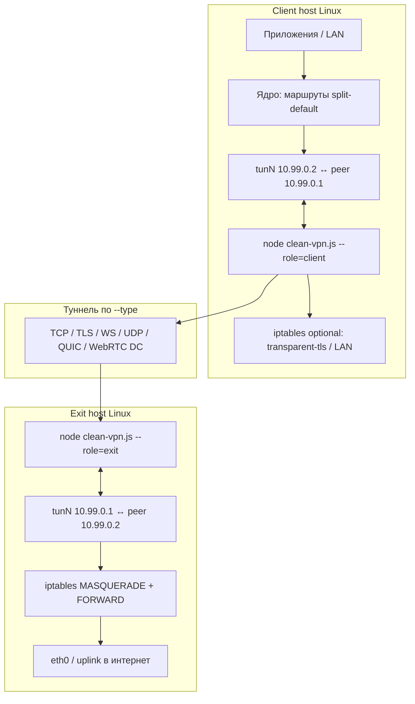
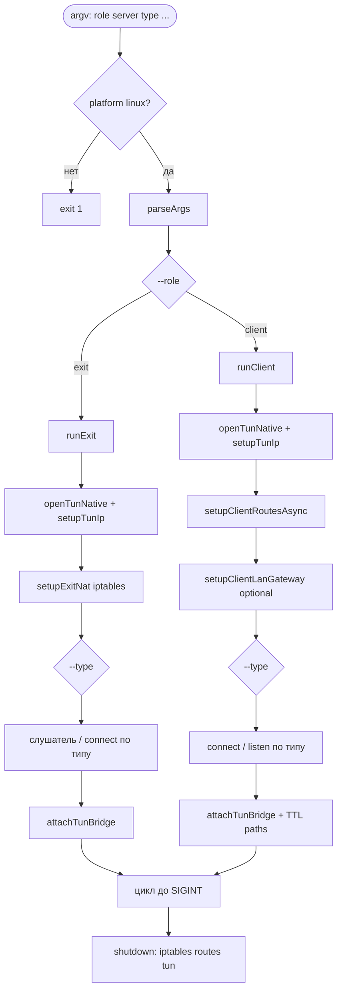
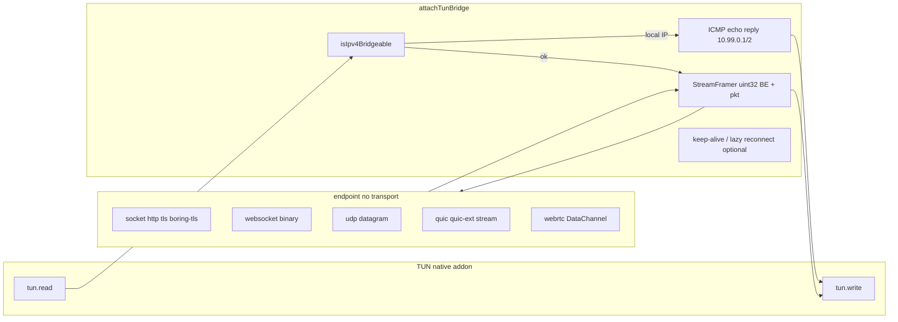
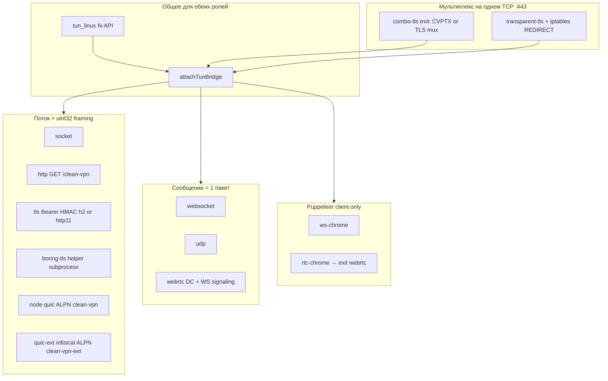
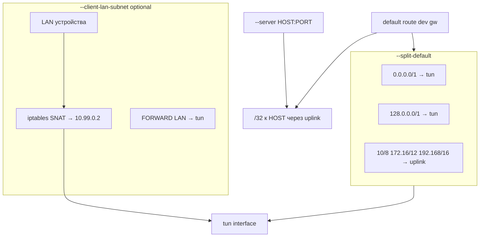
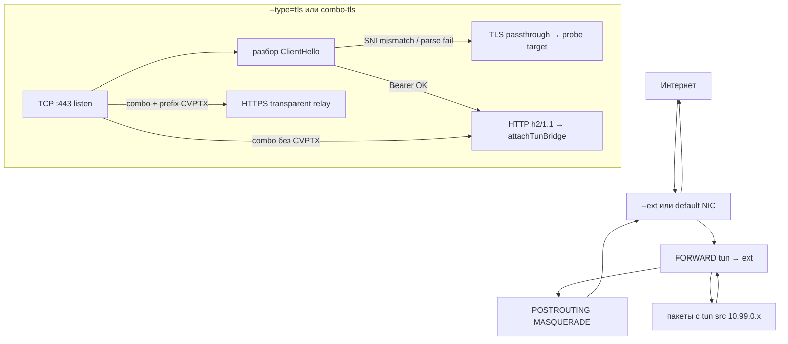
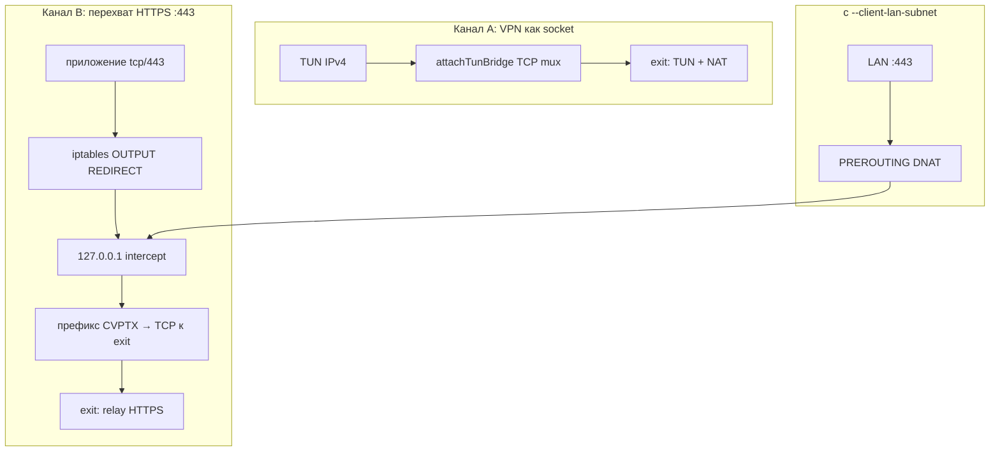
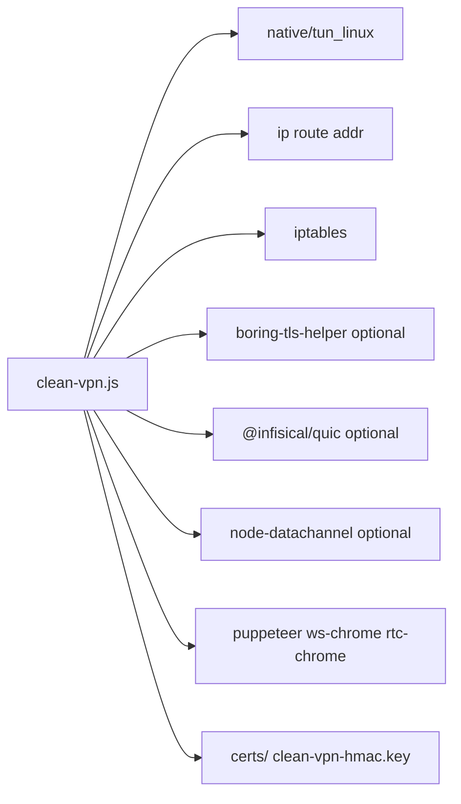

# Диаграммы: `clean-vpn.js`

Архитектура и потоки данных для [`scripts/clean-vpn.js`](clean-vpn.js).

---

## 1. Общая архитектура (client ↔ exit)



| Роль | TUN | Сеть на хосте |
|------|-----|----------------|
| **client** | `10.99.0.2` | С `--split-default`: IPv4 default → tun (`0.0.0.0/1` + `128.0.0.0/1`), RFC1918 → uplink; bypass к `--server` |
| **exit** | `10.99.0.1` | NAT трафика с tun в `--ext` (или default route) |

---

## 2. Точка входа и ветвление



---

## 3. Ядро: мост TUN ↔ транспорт

Все «обычные» VPN-типы сходятся в **`attachTunBridge`** (фильтр **`isIpv4Bridgeable`** — сейчас только IPv4).



**Протокол на потоковых транспортах** (socket, http после преамбулы, tls/h2, quic bidi):

```
[4 байта BE длина][сырой IPv4-пакет L3]
```

На **WebSocket / UDP / WebRTC DC** — одно сообщение/датаграмма = один пакет **без** префикса длины.

---

## 4. Слой транспортов (`--type`)



**Сигналинг (отдельно от IP-пакетов):** `webrtc`, `udp --punch`, `rtc-chrome` — WebSocket JSON; данные — DataChannel или UDP после punch.

---

## 5. Client: маршрутизация и LAN



Без `--split-default` на tun всё равно может быть трафик к peer `10.99.0.1` и IPv6 ND; в мост уходит только валидный **IPv4**.

---

## 6. Exit: NAT и TLS-ветки



---

## 7. `transparent-tls` / `combo-tls` на client (два канала)



На **client** `combo-tls`: TUN через **boring-tls-helper** (как `boring-tls`) + канал B как у `transparent-tls`.

---

## 8. Зависимости (вне Node)



---

## Легенда

| Элемент | Значение |
|---------|----------|
| `10.99.0.1` / `10.99.0.2` | exit / client на TUN |
| `StreamFramer` | `uint32 BE` + L3 для TCP/TLS/QUIC-stream |
| `isIpv4Bridgeable` | сейчас только IPv4 в туннель |
| SIGINT/SIGTERM | откат маршрутов, iptables, закрытие tun |
