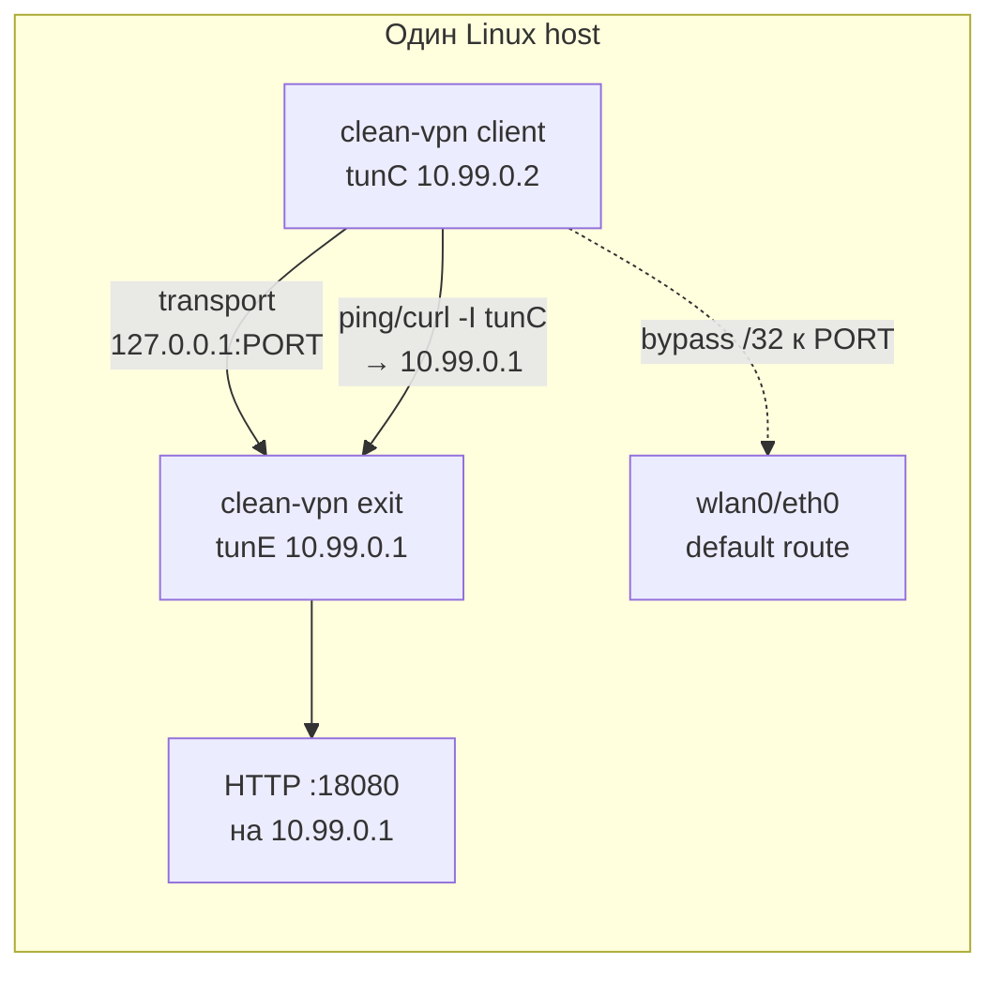
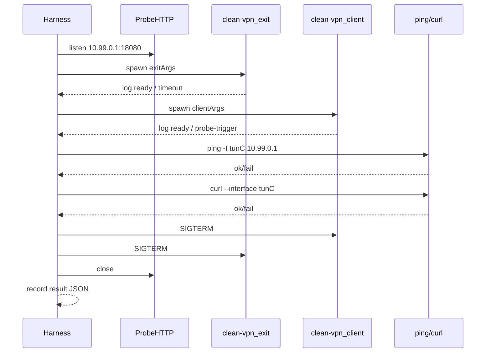

# clean-vpn: автоматизированное smoke-тестирование транспортов

План разработки harness-скрипта `clean-vpn-transports-test.mjs` для проверки, что **client ↔ exit** поднимают TUN-мост и пропускают IPv4 к peer **10.99.0.1**.

**Scope:** connectivity smoke (ping + HTTP через client TUN). **Не** throughput — для пропускной способности см. `scripts/test-*-throughput.js`, `scripts/stepwise-test.js`.

**Связанные файлы:**
- [clean-vpn.js](clean-vpn.js) — реализация транспортов
- [clean-vpn-security-analysis.md](clean-vpn-security-analysis.md) — security regression (H-4 local WS и т.д.; **не** входит в матрицу transport smoke)

---

## 1. Назначение

Один Linux-хост, два процесса `clean-vpn`:

| Роль   | TUN (типично) | IPv4 на TUN |
|--------|---------------|-------------|
| exit   | `tun0`        | 10.99.0.1   |
| client | `tun1`        | 10.99.0.2   |

Transport (TCP/WebSocket/TLS/…) идёт на **127.0.0.1:PORT** через bypass-маршрут uplink, **без** `--split-default`.

Проверка туннеля — с хоста, явно через **client TUN**:

```bash
ping -I "$TUN_CLIENT" -c 3 -W 2 10.99.0.1
curl -4 --interface "$TUN_CLIENT" --max-time 5 \
  http://10.99.0.1:18080/clean-vpn-test
```

---

## 2. Требования

| Компонент | Нужно для |
|-----------|-----------|
| Linux (не macOS без VM) | native TUN addon в `clean-vpn.js` |
| `sudo` / root | TUN, iptables NAT на exit |
| Node.js | запуск `clean-vpn.js` |
| `ping`, `curl` ≥ 7.40 | probes (`curl --interface`) |
| `ip`, `iptables` | маршруты, NAT |
| Chromium + Puppeteer | Tier 3 (`ws-chrome`, `rtc-chrome`) |
| `node-datachannel` | Tier 3 (`webrtc` на exit/client) |
| TLS/QUIC certs + `clean-vpn-hmac.key` | Tier 2 |
| Node 25+ + `--experimental-quic` | Tier 2 (`quic`) |

Preflight harness (Phase 0): `/dev/net/tun`, `node scripts/clean-vpn.js --help`, свободные порты из матрицы.

---

## 3. Топология (без петель)



### Почему без `--split-default`

- Default route остаётся на uplink → нет петли «весь интернет → TUN → transport → снова TUN».
- Трафик к **10.99.0.1** попадает в client TUN через point-to-peer (`setupTunIp`: `10.99.0.2 peer 10.99.0.1`).
- Сессия transport к `--server=127.0.0.1:PORT` идёт по **bypass** (`serverIp/32 via uplink`), не через TUN.

Константы в [clean-vpn.js](clean-vpn.js): `IP_EXIT = 10.99.0.1`, `IP_CLIENT = 10.99.0.2`. Имена интерфейсов: `findFreeTunName()` → `tun0`, `tun1`, …

### Обязательные флаги стенда

- Exit: `--role=exit --server=127.0.0.1:PORT --ext=lo` (NAT через `lo` достаточен для smoke)
- Client: `--role=client --server=127.0.0.1:PORT` — **без** `--split-default`
- Env: `PATH=$PATH` при `sudo`

---

## 4. Probes (pass/fail)

| Probe | Команда | Pass |
|-------|---------|------|
| ICMP | `ping -I "$TUN_CLIENT" -c 3 -W 2 10.99.0.1` | 0% packet loss |
| HTTP | `curl -4 --interface "$TUN_CLIENT" --max-time 5 -sf http://10.99.0.1:18080/clean-vpn-test` | exit 0, body содержит `clean-vpn-test-ok` |

### HTTP probe на exit TUN

В `clean-vpn` HTTP на 10.99.0.1 **не** поднимается. Harness стартует **отдельный** minimal server после того, как exit создал TUN (после `setupTunIp`):

```javascript
import http from 'node:http';

const PROBE_HOST = '10.99.0.1';
const PROBE_PORT = 18080;
const PROBE_MARKER = 'clean-vpn-test-ok';

export function startProbeHttpServer() {
  const srv = http.createServer((_req, res) => {
    res.writeHead(200, { 'Content-Type': 'text/plain' });
    res.end(PROBE_MARKER);
  });
  srv.listen(PROBE_PORT, PROBE_HOST);
  return srv;
}
```

Альтернатива без Node (временно, для ручной отладки):

```bash
socat TCP-LISTEN:18080,bind=10.99.0.1,reuseaddr,fork \
  SYSTEM:"printf 'HTTP/1.0 200 OK\r\nContent-Length: 18\r\n\r\nclean-vpn-test-ok\n'"
```

### Определение `$TUN_CLIENT`

1. Regex по логу client: `split-default … через tunN` / `TUN ↔` (если есть).
2. Diff `ip -br link show type tun` до/после старта client.
3. Fallback: второй `tun*` по порядку, если exit = `tun0`.

### Ожидание готовности client

| Тип | Признак в логе | Timeout |
|-----|----------------|---------|
| socket, http | TCP connected / нет ошибки 10s | 30s |
| websocket | `WebSocket connected` | 30s |
| tls, quic* | handshake ok, TUN bridge | 45s |
| ws-chrome, rtc-chrome (keep-alive) | `Chrome готов` / локальный WS; exit-path — **первый probe** | 60s |
| webrtc, rtc-chrome | `DataChannel … готов` или probe-trigger | 90s |

Для **ws-chrome / rtc-chrome + `--keep-alive`** без split-default: connect к exit lazy — **ping/curl к 10.99.0.1** сами триггерят DNS/SYN (`ipv4TriggersExitLazyConnect` в clean-vpn.js).

---

## 5. Матрица транспортов

Порты — база для локального стенда; harness может сдвигать `PORT + offset` при коллизии.

### Tier 1 — smoke CI (без Chrome / WebRTC / iptables)

| type | PORT | Exit | Client |
|------|------|------|--------|
| **socket** | 8765 | `--role=exit --type=socket --server=127.0.0.1:8765 --ext=lo` | `--role=client --type=socket --server=127.0.0.1:8765` |
| **http** | 8766 | `--role=exit --type=http --server=127.0.0.1:8766 --ext=lo` | `--role=client --type=http --server=127.0.0.1:8766` |
| **websocket** | 8767 | `--role=exit --type=websocket --ws-server --server=127.0.0.1:8767 --ext=lo` | `--role=client --type=websocket --server=127.0.0.1:8767` |

### Tier 2 — TLS / QUIC (certs + shared HMAC key)

Каталог сертификатов: например `scripts/fixtures/tls-test/` (создать один раз; exit автоген `clean-vpn-hmac.key` при отсутствии).

| type | PORT | Exit | Client |
|------|------|------|--------|
| **tls** | 8443 | `--role=exit --type=tls --server=127.0.0.1:8443 --tls-cert-dir=DIR --ext=lo` | `--role=client --type=tls --server=127.0.0.1:8443 --tls-cert-dir=DIR --tls-server-name=clean-vpn` |
| **boring-tls** | 8443 | (как tls exit) | `--role=client --type=boring-tls --server=127.0.0.1:8443 --tls-cert-dir=DIR` |
| **quic-ext** | 8444 | `--role=exit --type=quic-ext --server=127.0.0.1:8444 --quic-certs-dir=DIR --ext=lo` | `--role=client --type=quic-ext --server=127.0.0.1:8444 --quic-certs-dir=DIR` |
| **quic** | 8445 | `node --experimental-quic scripts/clean-vpn.js --role=exit --type=quic --server=127.0.0.1:8445 --quic-certs-dir=DIR --ext=lo` | `node --experimental-quic scripts/clean-vpn.js --role=client --type=quic --server=127.0.0.1:8445 --quic-certs-dir=DIR` |

Client **без** `--split-default` во всех кейсах.

### Tier 3 — Chrome / WebRTC (`SKIP_TIER3=1` в CI)

| type | PORT | Exit | Client |
|------|------|------|--------|
| **ws-chrome** | 8770 | `--role=exit --type=ws-chrome --ws-server --server=127.0.0.1:8770 --ext=lo` | `--role=client --type=ws-chrome --server=127.0.0.1:8770 --ws-chrome-executable=/usr/bin/chromium` |
| **webrtc** | 9876 | `--role=exit --type=webrtc --signaling --server=127.0.0.1:9876 --ext=lo --config=config/test-local.json` | `--role=client --type=webrtc --server=127.0.0.1:9876 --config=config/test-local.json --ice-mode=direct` |
| **rtc-chrome** | 9876 | `--role=exit --type=webrtc --signaling --server=127.0.0.1:9876 --ext=lo --config=config/test-local.json` | `--role=client --type=rtc-chrome --server=127.0.0.1:9876 --rtc-chrome-executable=/usr/bin/chromium --config=config/test-local.json` |

Минимальный `config/test-local.json` для loopback (пример):

```json
{
  "iceServers": [{ "urls": "stun:stun.l.google.com:19302" }]
}
```

Для жёстко локального ICE без STUN: `--allow-host-candidates` **только в test**, не в prod.

**`--split-default` + webrtc / udp --punch:** STUN/TURN из `--config` должны идти через uplink (не tun0). В логе client: `infra bypass STUN/TURN: …`. Проверка:

```bash
ip route get $(dig +short stun.l.google.com | head -1)
# dev eth0, не tun0
```

Exit punch: STUN с ephemeral UDP, reflexive port = bind `--server` (напр. `:443`).

### Tier 4 — manual / regression only

| type | Причина отложить |
|------|------------------|
| **udp --punch** | STUN, PORT+1 signaling; client `--split-default` требует infra bypass STUN/TURN из `--config` (авто в clean-vpn.js) |
| **transparent-tls** | iptables OUTPUT REDIRECT, CVPTX, второй listener |
| **combo-tls** | client + exit + iptables + boring-helper |

Документировать ручные команды отдельно при необходимости; не блокировать Tier 1 CI.

---

## 6. Жизненный цикл одного кейса



Шаги:

1. Preflight порта и root.
2. `startProbeHttpServer()` (или дождаться exit TUN, затем bind).
3. Spawn exit, `waitForLog(readyPattern, timeout)`.
4. Spawn client, `waitForLog` или sleep + probe retry.
5. Resolve `$TUN_CLIENT`.
6. Probe ping → probe curl (retry до 3×, backoff 2s).
7. Teardown: kill client, exit, probe; `iptables`/`route` откатывает сам clean-vpn при SIGTERM.
8. Append `{ id, tier, ping, curl, durationMs, exitCode }` в отчёт.

---

## 7. Keep-alive regression (Phase 3)

Только **ws-chrome**, **rtc-chrome** (и при желании plain websocket с `--keep-alive=5`).

Дополнительные флаги client: `--keep-alive=5`. **Без** `--split-default`.

| Шаг | Действие | Ожидание |
|-----|----------|----------|
| 1 | ping + curl | pass (initial connect) |
| 2 | `sleep 6` | в логе client: idle / «WS к exit сброшен» / keep-alive 5s |
| 3a | **immediate**: ping + curl | pass (reconnect) |
| 3b | **delayed** (`--reconnect-delay=15`): sleep 15, ping + curl | pass (regression lazy reconnect) |

Harness flags: `--keep-alive`, `--reconnect-delay=15`.

Env для отладки: `CLEAN_VPN_KEEPALIVE_DEBUG=1`.

---

## 8. План разработки `clean-vpn-transports-test.mjs`

### Phase 0 — каркас

```bash
sudo env PATH=$PATH node scripts/clean-vpn-transports-test.mjs \
  --tier=1 [--transport=socket] [--verbose] [--json report.json]
```

- Preflight: root, `/dev/net/tun`, help clean-vpn
- `spawnCleanVpn(extraArgs)`, `waitForLog(stream, re, ms)`, `killTree(pid)`
- SIGINT/SIGTERM → cleanup всех детей
- Парсинг TUN client

### Phase 1 — socket end-to-end

Первый полный кейс Tier 1 (`socket`): probe HTTP → exit → client → ping + curl → JSON `{ transport: "socket", ping: true, curl: true }`.

### Phase 2 — матрица Tier 1–2

Конфиг в `.mjs`:

```javascript
/** @type {Array<{ id: string, tier: number, port: number, exitArgs: string[], clientArgs: string[], readyPattern: RegExp, clientTimeoutMs?: number }>} */
export const TRANSPORTS = [
  {
    id: 'socket',
    tier: 1,
    port: 8765,
    exitArgs: ['--role=exit', '--type=socket', '--server=127.0.0.1:8765', '--ext=lo'],
    clientArgs: ['--role=client', '--type=socket', '--server=127.0.0.1:8765'],
    readyPattern: /connected|подключено|TCP/i,
  },
  // http, websocket, tls, …
];
```

Summary table в stdout; `--json report.json` для CI.

### Phase 3 — Tier 3 + keep-alive

- `SKIP_TIER3=1` по умолчанию в CI
- Subcommand или `--keep-alive` для сценария §7

### Phase 4 — CI (optional)

```yaml
# пример job
- run: sudo env PATH=$PATH node scripts/clean-vpn-transports-test.mjs --tier=1 --json /tmp/report.json
- uses: actions/upload-artifact@v4
  if: failure()
  with:
    name: clean-vpn-transport-logs
    path: /tmp/report.json
```

Tier 1 only на каждый PR; Tier 2 nightly; Tier 3 manual.

---

## 9. Риски и mitigations

| Риск | Mitigation |
|------|------------|
| Probe до готовности transport | `waitForLog` + retry ping/curl 3×, backoff 2s |
| Зомби Chromium | `killTree`, cleanup trap, `pkill -f clean-vpn` в dev |
| Порт занят | `PORT_BASE + hash(id)` или preflight `ss -ltn` |
| Старый curl без `--interface` | Preflight `curl --version`; fallback ping-only + WARN |
| webrtc ICE fail на loopback | `config/test-local.json`, `--ice-mode=direct`, test-only `--allow-host-candidates` |
| Нет прав на TUN | явный fail preflight с hint `sudo` |
| ARM Chromium / Puppeteer | `--ws-chrome-executable`, см. шапку clean-vpn.js |
| keep-alive reconnect flake | Phase 3 immediate + delayed; `CLEAN_VPN_KEEPALIVE_DEBUG=1` |

---

## 10. Ручной запуск (без harness)

### socket (Tier 1 baseline)

Терминал 1 — probe HTTP (после появления tun exit, ~2s):

```bash
node -e "
const http=require('http');
http.createServer((q,r)=>{r.end('clean-vpn-test-ok');})
  .listen(18080,'10.99.0.1',()=>console.log('probe ok'));
"
```

Терминал 2 — exit:

```bash
sudo env PATH=$PATH node scripts/clean-vpn.js \
  --role=exit --type=socket --server=127.0.0.1:8765 --ext=lo
```

Терминал 3 — client (**без** split-default):

```bash
sudo env PATH=$PATH node scripts/clean-vpn.js \
  --role=client --type=socket --server=127.0.0.1:8765
```

Терминал 4 — probes (`tun1` заменить на фактический client TUN):

```bash
TUN=tun1
ping -I "$TUN" -c 3 10.99.0.1
curl -4 --interface "$TUN" -sf http://10.99.0.1:18080/ ; echo
```

### ws-chrome + keep-alive (Tier 3)

Exit:

```bash
sudo env PATH=$PATH node scripts/clean-vpn.js \
  --role=exit --type=ws-chrome --ws-server --server=127.0.0.1:8770 --ext=lo
```

Client:

```bash
sudo env PATH=$PATH CLEAN_VPN_KEEPALIVE_DEBUG=1 node scripts/clean-vpn.js \
  --role=client --type=ws-chrome --server=127.0.0.1:8770 \
  --keep-alive=5 --ws-chrome-executable=/usr/bin/chromium
```

Ожидание: Chrome стартует сразу; `WebSocket к exit готов` — после первого ping/curl к 10.99.0.1.

После 5s idle — снова ping/curl (immediate reconnect test).

---

## 11. Deliverables

| Артефакт | Статус |
|----------|--------|
| `scripts/clean-vpn-transports-test.md` | этот документ |
| `scripts/clean-vpn-transports-test.mjs` | Phase 0–1 (следующий PR) |
| `config/test-local.json` | по необходимости для Tier 3 |
| `scripts/fixtures/tls-test/` | по необходимости для Tier 2 |

---

## 12. Отличие от других тестов

| Скрипт | Задача |
|--------|--------|
| **clean-vpn-transports-test** | smoke: каждый `--type` поднимает TUN client↔exit |
| `test-websocket-throughput.js` | raw WS Mbps, без clean-vpn |
| `test-webrtc-throughput.js` | raw WebRTC, без clean-vpn |
| `stepwise-test.js` | слои mesh VPN stack |
| [clean-vpn-security-analysis.md](clean-vpn-security-analysis.md) | ручные security checks (H-4, TLS bearer, …) |
