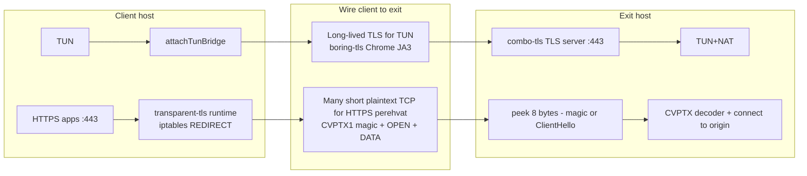
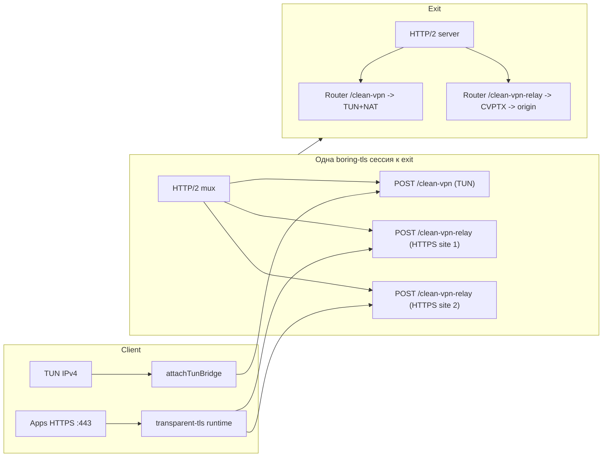
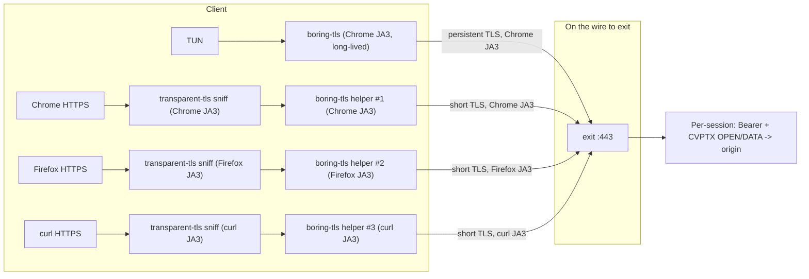

# Combo-TLS / Transparent-TLS — улучшение конфиденциальности

> **2026-05:** **Подход C (enc-SNI relay)** реализован — CVPTX wire удалён (BREAKING). См. раздел «Подход C» ниже. H-3 (magic + cleartext OPEN) закрыт для HTTPS intercept.

## Контекст

В аудите безопасности [`scripts/clean-vpn-security-analysis.md`](clean-vpn-security-analysis.md)
зафиксированы два связанных недочёта в HTTPS-перехвате `transparent-tls` /
`combo-tls`:

- **H-3 (High)** — HTTPS-ветка отправляет CVPTX-кадр `OP_OPEN` поверх
  **plaintext TCP** к exit. В этом кадре открыто видны magic `CVPTX1\r\n`,
  origin host (`a.test:443`), Bearer и HMAC. См.
  [`scripts/lib/transparent-tls-wire.mjs`](lib/transparent-tls-wire.mjs)
  (`TTL_FRAME_MAGIC_PREFIX`, `encodeOpenFrame`) и
  [`scripts/lib/transparent-tls-runtime.mjs`](lib/transparent-tls-runtime.mjs)
  (`net.connect(host, port)` ~431-437 — без TLS).
- **M-3 (Medium)** — `OP_DATA` (тело перехваченного HTTPS) идёт **без MAC и без
  sequence**. Активный MitM, имеющий доступ к TCP-байтам между client и exit,
  может вырезать или вставить блоки.

Содержимое внутри `OP_DATA` — это уже шифрованный TLS приложения с origin'ом
(client→origin TLS-handshake идёт сквозь нашу прокси-обёртку), поэтому угроза
H-3/M-3 — не о чтении полезной нагрузки, а о:

- **DPI fingerprint:** маркер `CVPTX1\r\n` на проводе client→exit моментально
  выдаёт VPN при активном/пассивном инспектировании.
- **Probing:** ясно видны метаданные (host/Bearer) для сторонней слежки и
  возможной репликации запросов.
- **Целостность:** отсутствие MAC на `OP_DATA` позволяет stripping/insertion
  fragment'ов TLS-handshake'a и потенциально crash/hang клиента приложения.

Цель этого документа — выбрать конкретный способ убрать plaintext и добавить
integrity для CVPTX, **при этом не ломая** уже работающие схемы маскировки
ClientHello (boring-tls, профиль браузера).

## Текущее устройство (как сейчас)



Главная аномалия — два **разных по криптокачеству** канала на одном порту exit:
зашифрованный TUN-канал boring-tls и **plaintext** CVPTX-канал HTTPS-перехвата.

## Что хотим получить

1. **Убрать plaintext** на client→exit для HTTPS-перехвата: ни magic, ни
   host/SNI, ни Bearer не должны быть видны DPI.
2. **Получить per-byte/per-frame integrity** для `OP_DATA` — закрыть M-3.
3. **Сохранить DPI-имитацию ClientHello** (JA3/JA4) для combo-tls. По
   возможности — улучшить её для HTTPS-перехвата (на сегодня для
   HTTPS-перехвата вообще нет ClientHello — там сырой TCP).

Дополнительные пожелания:

- Минимум latency на новое HTTPS-перехваченное соединение (TLS handshake
  стоит дорого).
- Минимум усложнения boring-tls helper'а: его архитектура «один процесс — одна
  TLS-сессия» работает, и переход к multi-session helper'у — дорого.
- Совместимость с deployment'ом за Cloudflare (см.
  [`scripts/cloudflare.md`](cloudflare.md)).

## Подход C: enc-SNI relay v2 base62 (реализован, BREAKING)

**Статус:** заменяет CVPTX wire целиком (без dual-version). Client и exit обновляются **вместе**.  
**Wire v2 (2026):** base32hex v1 удалён → **base62** (`0-9`, `a-z`, `A-Z`), plaintext version `0x02`, HKDF context `transparent-tls-enc-sni-v2`.

### Суть

- Client→exit: **raw TCP**, первые байты — TLS ClientHello с SNI `<encLabels>.--tls-public-name`.
- Origin hostname + port зашифрованы в DNS-label (**AES-256-GCM**, HKDF от `clean-vpn-hmac.key`, blob **base62** LDH-safe).
- Длинный blob режется на labels ≤63 символа; суффикс `.publicName` match case-insensitive, **enc prefix case-preserving** (для base62).
- Exit: parse ClientHello → decrypt label → `connect(port, hostname)` → restore origin SNI в CH → duplex pipe.
- **`--tls-public-name` обязателен** на client и exit для HTTPS intercept (`transparent-tls`, `combo-tls`).

### Dispatch (без magic `CVPTX1`)

| Exit type | Маршрут relay | Иначе |
|-----------|---------------|--------|
| `combo-tls` | SNI `*.publicName` + decrypt OK | TLS mux (`--type=tls`) |
| `transparent-tls` | первый байт `0x16` (TLS) | IPv4 socket bridge (TUN) |

### Закрывает (из аудита)

- **H-3 CVPTX magic** — протокол удалён (`transparent-tls-wire.mjs`).
- **H-3 cleartext OPEN** (origin/fake/host в кадре) — удалён.
- **Same-length SNI limit** — variable-length rebuild (`transparent-tls-ch-rebuild.mjs`).

### Остаётся

- **M-3** — raw TCP relay без per-frame MAC на uplink (нужен Подход A/B для полного fix).
- Plaintext TLS ClientHello на client→exit (SNI = `*.publicName`, без magic).
- HTTP/3 (QUIC), ECH, pattern `*.publicName`.

### Модули

- [`scripts/lib/transparent-tls-enc-sni.mjs`](lib/transparent-tls-enc-sni.mjs)
- [`scripts/lib/transparent-tls-ch-rebuild.mjs`](lib/transparent-tls-ch-rebuild.mjs)
- [`scripts/lib/transparent-tls-runtime.mjs`](lib/transparent-tls-runtime.mjs) — `wireTransparentTlsEncSniSession`, `attachTransparentTlsClientSession`

### E2E

```bash
# exit
sudo node scripts/clean-vpn.js --role=exit --server=0.0.0.0:443 \
  --type=combo-tls --tls-public-name=vpn.example.com

# client
sudo node scripts/clean-vpn.js --role=client --server=EXIT:443 \
  --type=combo-tls --split-default --tls-public-name=vpn.example.com
```

---

## Подход A: один TLS-канал client→exit + HTTP/2 mux



### Суть

- Между client и exit устанавливается **одна** boring-tls сессия с
  Chrome-like профилем (как сейчас для TUN combo-tls).
- Внутри сессии — HTTP/2, и каждый перехваченный HTTPS-connection
  приложения получает **отдельный stream** `/clean-vpn-relay`. TUN идёт через
  отдельный stream `/clean-vpn`.
- CVPTX OPEN/OP_DATA идут внутри stream **без** outer magic — внутри HTTP/2
  они не нужны.
- M-3 закрыт автоматически — TLS record layer даёт MAC бесплатно.

### Плюсы

- **Один TLS-handshake** на всю сессию. Открытие нового перехваченного
  HTTPS-соединения = 0-RTT (`http2.session.request`).
- **Низкие ресурсы на exit**: один TLS-state + один HTTP/2-state на client.
- **Простой router на exit**: уже есть `tlsExitHttp2Server` под `/clean-vpn`,
  добавить второй handler под `/clean-vpn-relay`.
- **Имитация Chrome ClientHello** работает прямо сейчас — ничего не надо
  менять в boring-tls helper'е.
- **Совместимо с Cloudflare**: один TLS-handshake на orange-cloud, далее h2
  mux работает как обычный HTTPS-сайт за CDN.
- **Отказоустойчивость:** все streams используют один TCP — DPI видит **одно
  стабильное соединение** к CDN, как у нормального долгого
  WebApp/gmail/github.
- **Reuse имеющегося кода**: HTTP/2 server и роутер на exit уже частично
  реализованы (см. `tlsExitHttp2Server`,
  [`scripts/http2.md`](http2.md)).

### Минусы

- **Один JA3 на всё**: если на клиенте параллельно работает Chrome,
  Telegram, curl — все их перехваты client→exit имеют один и тот же
  Chrome-like JA3. DPI с поведенческим анализом может это заметить:
  «trafic of multiple apps in one TLS stream, all with Chrome JA3».
- **DPI-аномалия heavy-user**: один TLS-стрим с гигантским объёмом данных
  (TUN + все HTTPS) к одному IP — нетипично для обычного пользователя.
  За CDN — нивелируется (нормально для долгих WebApp-сессий).
- **Hard failure**: обрыв этой TLS-сессии = обрыв TUN **и** всех HTTPS
  одновременно. Заметно для DPI (одновременный пик RST'ов).
- **SNI один на всё**: настоящий Chrome к разным сайтам имеет разные SNI,
  у нас всегда один.

### Сложность реализации

| Часть | Объём работы |
|-------|--------------|
| Client: `http2.connect()` поверх boring-tls socket; per-relay `session.request()` | Средний |
| Exit: добавить router в `tlsExitHttp2Server` для `/clean-vpn-relay` | Низкий |
| Wire: убрать magic для combo-mode; `encodeOpenFrameBare`/`encodeDataFrameBare` | Низкий |
| boring-tls helper | Не трогаем |
| Migration: dual-route на exit (peek-magic + h2) на 1 минор | Средний |

## Подход B: per-relay TLS с динамическим JA3 (имитация JA3 приложения)



### Суть

- TUN combo-tls остаётся как сейчас: длинная boring-tls сессия с Chrome JA3.
- Каждое HTTPS-перехваченное приложение получает **свою отдельную TLS-сессию**
  client→exit. ClientHello этой сессии генерируется boring-tls helper'ом с
  **профилем, извлечённым из перехваченного ClientHello приложения**.
- Внутри каждой такой сессии — Bearer + CVPTX OPEN/OP_DATA, без magic.
- Standalone `transparent-tls` (без combo) — HTTPS-relay часть оборачивается
  в **простой Node TLS** (наш дефолтный JA3, без имитации). Это
  отладочный режим без претензий на DPI-резистентность.

### Плюсы

- **JA3-разнообразие на проводе**: реальный мульти-приложенческий профиль.
  Если у юзера Chrome+Firefox+curl, DPI видит ровно эти три JA3 client→exit.
  Это **сильно ближе** к норме, чем «всё под одним JA3».
- **Короткие сессии**: каждое HTTPS-соединение к origin'у = короткая
  TLS-сессия к exit. Нет heavy-user паттерна.
- **Per-connection отказоустойчивость**: обрыв одного relay не валит TUN и
  остальные.
- **Использует фичу boring-tls helper'а по назначению** — динамический
  ClientHello из json-профилей.

### Минусы

- **TLS-handshake на каждое перехваченное соединение** — это +1 RTT и +CPU
  на каждое первое подключение к новому сайту. Заметно для пользователя на
  медленных каналах.
- **Большое количество одновременных TLS-сессий на exit**: больше FD,
  больше state, нужны лимиты и пулы.
- **boring-tls helper нужно переделать** на multi-session или поднимать
  **пул процессов** (один helper = одна сессия по текущей архитектуре, см.
  [`scripts/boring-tls-plan.md`](boring-tls-plan.md)). Это **значимая**
  работа в `native/boring_tls`.
- **Извлечение профиля из перехваченного ClientHello**: парсер ClientHello →
  JA3-компоненты (ciphers, extensions, curves, sig algs, ALPN, GREASE) →
  json-профиль для helper'а. Сейчас парсер ClientHello есть в
  `transparent-tls-runtime.mjs` (для fake-SNI patch), но он **не**
  выгружает полный JA3-профиль. Нужен новый модуль.
- **Точная имитация байт-в-байт невозможна**: JA3 — это только список
  extension'ов в нужном порядке; raw-bytes ClientHello (GREASE-значения,
  extension data) не полностью контролируется helper'ом. JA3 совпадёт; JA4
  тоже; полные байты — нет. DPI с tcpdump-сравнением заметит. Но JA3/JA4 —
  это всё, что обычно проверяют.
- **SNI остаётся нашим**: даже с разными JA3, поле `server_name` во всех
  ClientHello — наш `vpn.example.com`. Реалистично было бы fake SNI =
  origin SNI (как `transparent-tls` уже делает для outer TLS к origin'у).
  Но тогда на exit нужен **SNI-роутинг** или wildcard cert: exit видит
  ClientHello c `server_name=youtube.com` и должен ответить валидным
  cert'ом. Возможно за Cloudflare (CF orange-cloud routes by SNI), но **не**
  возможно на чистом IP exit без дополнительного PKI.
- **Несовместимо с строгим CDN**: Cloudflare на free может рейт-лимитить
  «много новых TLS connections с одного client IP» как DDoS-сигнал.
- **TUN-канал combo-tls остаётся long-lived** с Chrome JA3 — это всё ещё
  одна аномальная сессия + N коротких. Смешанная картина не идеальна.

### Сложность реализации

| Часть | Объём работы |
|-------|--------------|
| Client: парсер ClientHello → JA3-профиль | Высокий |
| Client: spawn boring-tls helper'а с динамическим профилем per-relay | Высокий |
| Client: пул helper-процессов или multi-session helper | Высокий (native/boring_tls) |
| Exit: принять N независимых TLS-сессий + Bearer на каждой | Низкий |
| Wire: убрать magic; CVPTX внутри TLS | Низкий |
| Migration: dual-route на exit (legacy peek-magic + new TLS) | Средний |
| Fake-SNI per-relay (опционально) | Высокий (требует SNI-роутер на exit или CDN) |

## Гибрид (A для combo + B как опциональный режим)

- По умолчанию — **A** (mux): простой код, low latency, отлично за CDN.
- Опциональный флаг `--combo-cvptx-per-relay-tls --mimic-app-ja3` — включает
  **B** для пользователей, которым нужна максимальная маскировка без CDN.

**Плюс:** гибкость и плавная миграция.

**Минус:** двойная кодовая база — реализация и поддержка **обоих** подходов.
Боринг-helper всё равно надо доработать под multi-session — иначе B не
включить.

## Сравнительная таблица

| Аспект | A: mux (один JA3) | B: per-relay (динамический JA3) |
|--------|-------------------|--------------------------------|
| Latency на новое HTTPS-перехваченное соединение | ~0 RTT (h2 stream) | +TLS handshake (1-2 RTT) |
| CPU/память/FD на exit | Низкие | Высокие |
| DPI-realism (поведенческий анализ) | Слабый: один JA3 на разные приложения, heavy-user паттерн | Сильный: JA3 как у реального приложения |
| DPI-realism за CDN | Сильный (HTTPS-к-CDN = норма) | Сильный, но с риском CDN-rate-limit |
| Магия `CVPTX1\r\n` на проводе | Уходит (внутри TLS) | Уходит (внутри TLS) |
| Per-frame integrity (M-3) | От TLS record layer | От TLS record layer |
| Отказоустойчивость при обрыве | Hard (всё валится) | Soft (один relay) |
| boring-tls helper изменения | Нет | Большие (multi-session или pool) |
| Парсер ClientHello → JA3-профиль на client | Не нужен | Нужен новый модуль |
| Fake SNI per-relay | Не применимо | Нужен SNI-роутер на exit или CDN |
| SNI на проводе | Один (наш) | Один (наш), если не fake SNI |
| Reuse существующего кода | Высокий (tlsExitHttp2Server, http2 уже частично работает) | Низкий |
| Совместимость с Cloudflare | Отличная | Под вопросом (rate-limit) |
| Период миграции (dual-route на exit) | Простой | Простой |

## Где какой подход выигрывает

- **Если exit за Cloudflare / другим CDN** — преимущество B нивелируется,
  потому что DPI до CDN видит трафик к крупному провайдеру и не сравнивает
  JA3 «между приложениями одного клиента». **A — оптимальный выбор.**
- **Если exit на bare-IP без CDN** — DPI видит «один IP с trafic'ом разных
  приложений», и B значимо лучше скрывает множественность.
- **Если deployment смешанный (часть юзеров за CDN, часть нет)** — гибрид.
- **Если приоритет latency и простота кода** — A.
- **Если приоритет максимум поведенческой маскировки** — B, но платим
  доработкой boring-tls helper'а и парсера ClientHello.

## Замечания об ограничениях обоих подходов

- **JA3 не равен «полному ClientHello»**: даже динамический JA3 в B не
  гарантирует байт-в-байт идентичности с перехваченным ClientHello.
  GREASE-значения, точные lengths extension'ов, padding — отличаются.
  DPI, который смотрит на полный raw-CH через сравнение хешей пакетов,
  заметит. JA3/JA4-only DPI — не заметит.
- **Destination IP** даёт самый сильный сигнал. Любой подход палится,
  если у DPI есть blacklist IP. CDN решает это; без CDN — нет.
- **Тайминги/объёмы**: пользователь, который через TUN качает 1 ГБ в
  минуту через одно соединение к CDN — это всё ещё heavy-user паттерн,
  даже за CDN. Не лечится JA3-обфускацией.

## Открытые вопросы (требуют решения перед реализацией)

1. **Что выбираем — A, B или гибрид?** От этого зависит объём работы по
   boring-tls helper'у и client-парсеру ClientHello.
2. **Если B — что делаем с SNI?** Оставляем наш (DPI заметит несоответствие
   JA3/SNI) или делаем fake-SNI per-origin + SNI-роутер на exit / CDN?
3. **Migration period:** держим ли legacy peek-magic на exit одновременно с
   новой схемой и сколько релизов?
4. **Standalone `transparent-tls`:** оставляем как отдельный режим (тогда
   решаем, что с ним — Node TLS или удаляем) или сливаем с combo-tls
   полностью?
5. **Bearer внутри новой TLS-обёртки:** какой формат — продолжаем v2 с
   exporter binding из Phase 2 этого плана? Логично — да, иначе двойная
   проверка.

## Зависимости от других задач

- **Phase 2 fix H-1/H-2 (TLS exporter binding для Bearer)** — должна идти
  **до** обоих подходов A/B, потому что Bearer внутри новой
  TLS-обёртки/streams будет использоваться с exporter-binding.
- **Boring-tls multi-session helper** (если выбираем B или гибрид) — нужен
  отдельный план в [`scripts/boring-tls-plan.md`](boring-tls-plan.md):
  multi-session API, lifecycle, IPC opcode `start-session` / `end-session`,
  per-session ClientHello profile.
- **Парсер ClientHello → JA3-профиль** (если B/гибрид) — новый модуль рядом
  с [`scripts/lib/transparent-tls-runtime.mjs`](lib/transparent-tls-runtime.mjs).
  Частично код для парсинга ClientHello уже есть (fake-SNI), но нужно
  расширить.

## Что НЕ делаем в этой задаче

- Не трогаем outer TLS client→origin (внутри `OP_DATA`) — это TLS
  приложения, мы только проксируем.
- Не вводим стандарт типа DPI-resistant tunneling protocol (REALITY/XTLS
  и т.п.) — обсуждаем только локальный фикс H-3/M-3 в рамках текущей
  архитектуры clean-vpn.
- Не делаем фейк-SNI per-relay в первой итерации — это отдельный большой
  кусок (SNI-роутинг на exit/CDN).

## Связанные документы

- [`scripts/clean-vpn-security-analysis.md`](clean-vpn-security-analysis.md)
  — пункты H-3 и M-3 в общем аудите.
- [`scripts/transparent-tls-plan.md`](transparent-tls-plan.md) — исходный
  дизайн CVPTX.
- [`scripts/boring-tls-plan.md`](boring-tls-plan.md) — текущая
  архитектура boring-tls helper'а (single-session).
- [`scripts/http2.md`](http2.md) — HTTP/2 в clean-vpn.
- [`scripts/cloudflare.md`](cloudflare.md) — CDN deployment.
- [`scripts/wss.md`](wss.md) — обсуждение DPI для tls/wss.
