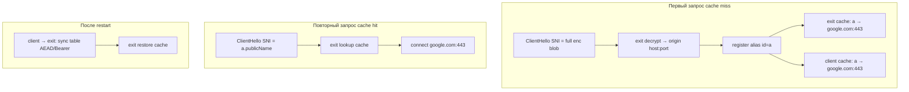

# enc-SNI: stateful dictionary compression (alias cache)

Документ описывает **опциональную фазу 2** поверх текущего enc-SNI relay (raw TCP TLS + encrypted label в SNI).  
**Не заменяет** base62 v2 и не требует pre-encrypt base64 / bit-packing hostname.

## Мотивация

Сейчас каждый HTTPS-intercept несёт **полный** enc-blob в SNI (`<encLabels>.<publicName>`), stateless, ~60–75 sym (enc-SNI **v2 base62**).

При **повторных** запросах к тем же origin (типичный браузинг) можно слать **короткий alias**:

```
a.example.com  →  google.com:443
```

Выигрыш по длине SNI: **~70–85%** на repeat (SNI ~13–20 sym vs ~75 sym).

Цена: **состояние** на client и exit, синхронизация при restart, новая ветка dispatch.

---

## Принцип



| Этап | Client SNI | Exit |
|------|------------|------|
| Cache miss | полный enc-SNI (как сейчас) | decrypt → origin; **выдать/принять alias** |
| Cache hit | `<alias>.publicName` (короткий) | lookup cache → origin |
| После restart | сначала **sync**, потом alias; иначе fallback full enc | принять sync или miss → full enc |

---

## Формат SNI: три типа (combo-tls exit)

Exit должен различать **три** класса входящего ClientHello SNI:

| Тип | Пример | Маршрут |
|-----|--------|---------|
| **Full enc** | длинный base62 prefix + `.publicName` | enc-SNI relay (decrypt) |
| **Alias** | `a.publicName`, `z99.publicName` | enc-SNI relay (cache lookup) |
| **VPN mux** | `www.google.com`, `--tls-public-name` | boring-tls / TLS mux → TUN |

Без отдельной ветки alias короткий `a.publicName` **не decrypt’ится** и на combo-tls уйдёт в **boring-tls** (ложный маршрут).

### Распознавание alias vs full enc

Heuristic (v1 proposal):

- suffix `.publicName` (case-insensitive для public name);
- prefix — **один или несколько коротких labels** из alphabet alias (см. ниже), **не** похожих на base62 blob (длина ≤ N, например ≤8 sym, только `[a-z0-9]` без uppercase для alias id);
- full enc blob — длинный, base62 с `A-Z`, несколько labels по 63 sym.

Явный маркер в plaintext enc (version bit «this is alias ref») **не нужен** — тип определяется по форме prefix до dispatch.

---

## Alias ID: генерация

Последовательность per client cache (пример):

```
a, b, c, …, z, aa, ab, …, zz, a1, a2, …, z99, …
```

Правила:

- один alias label = один DNS label (≤63 B);
- хранить `(hostname, port)` — port обязателен (non-443);
- max entries + LRU/TTL на client и exit;
- при исчерпании namespace — fallback на full enc или расширить alphabet/длину id.

Пример mapping (логическая запись):

```
a  → google.com:443
b  → www.youtube.com:443
```

Wire SNI: `a.publicName`, `b.publicName`.

---

## Scope кэша

| Модель | Когда OK | Риск |
|--------|----------|------|
| **Per client** (peer IP + Bearer/exporter session) | multi-user exit | сложнее lookup |
| **Per deployment** (1 client ↔ 1 exit) | домашний VPN | простая реализация |
| **Global exit** | никогда для shared exit | client A: `a→google`, client B: `a→facebook` — **конфликт** |

**Рекомендация MVP:** per Bearer-bound session (combo-tls) или per source IP + PSK epoch.

---

## Синхронизация при restart

Самая сложная часть протокола.

### Требования

1. Client **не шлёт alias**, пока exit не подтвердил sync (или miss → full enc).
2. Exit после restart: пустой cache до sync или persist на диск.
3. Sync **аутентифицирован** (Bearer + exporter binding или AEAD с PSK).
4. Idempotent: повтор sync безопасен.
5. Version/epoch таблицы для merge policy.

### Канал sync

| Режим | Канал | Сложность |
|-------|-------|-----------|
| **combo-tls** | новый HTTP/2 stream, напр. `POST /clean-vpn-enc-sni-cache` поверх boring TLS mux | низкая (reuse Bearer) |
| **transparent-tls only** | отдельный control stream **или** только full enc без cache | высокая |

**MVP:** combo-tls only; transparent-tls — cache off или full enc always.

### Формат sync (черновик)

```
epoch: u64
entries: [{ id: "a", host: "google.com", port: 443 }, …]
```

AEAD envelope или TLS-inside + Bearer как у `/clean-vpn`.

### Client-side persist (опционально)

Файл, напр. `--tls-cert-dir/enc-sni-cache.json` (или отдельный path):

- ускоряет restart client;
- **не секрет**, но privacy leak habit (куда ходил user);
- после load — **обязательно** sync на exit перед alias.

---

## Client / exit модули (черновик структуры)

| Файл | Роль |
|------|------|
| `scripts/lib/transparent-tls-sni-dictionary.mjs` | shared: alias gen, encode hit/miss, parse alias SNI |
| client hook в `transparent-tls-runtime.mjs` | miss → full enc + register; hit → alias SNI |
| exit hook в `wireTransparentTlsEncSniSession` + dispatch | alias lookup branch |
| `clean-vpn.js` HTTP/2 handler | sync endpoint (combo-tls) |

---

## Безопасность

| Аспект | Full enc (сейчас) | Alias cache |
|--------|-------------------|-------------|
| Скрытие host на wire | да (каждый раз) | только первый раз; repeat — **короткий id** |
| Replay | expiry в AEAD plaintext | alias без expiry → **долгоживущий** handle |
| DPI pattern | длинный random-ish blob | `a.publicName`, `b.publicName` — **узнаваемо** |
| Cross-client | N/A (stateless) | нужен **strict scope**, иначе poisoning |
| Sync channel | — | must be auth + integrity |

Full enc остаётся fallback для sensitive / first visit / после TTL.

---

## Сравнение с другими оптимизациями

| Мера | Δ длины SNI | Stateful | Сложность |
|------|-------------|----------|-----------|
| base62 v2 (wire blob) | ~15–20% | нет | **низкая** |
| ChaCha20 vs AES-GCM | ~0% | нет | — |
| base64 hostname pre-encrypt | **+30%** | нет | не делать |
| 6-bit LDH pack hostname | ~3–10 sym | нет | средняя |
| **Alias dictionary (этот doc)** | **~70–85%** repeat | **да** | **средне-высокая** |

---

## Оценка трудозатрат

### MVP (1 client ↔ 1 exit, combo-tls, in-memory)

~**1–2 недели**:

- `transparent-tls-sni-dictionary.mjs`
- client: miss/hit + alias SNI rebuild
- exit: alias branch в dispatch + lookup
- sync via HTTP/2 + Bearer
- fallback full enc on miss
- unit tests + один e2e curl loop

**Не в MVP:** transparent-tls-only, disk persist, multi-tenant, LRU production.

### Production

~**3–6 недель**:

- per-client scope на exit
- transparent-tls sync или явный «cache disabled»
- persistence + migration
- TTL / max size / LRU
- race-free «sync before alias» handshake
- docs + version bump (`enc-sni alias v1`)

---

## Рекомендуемый порядок внедрения

1. **base62 v2** — stateless BREAKING, низкий риск ([`enc-sni_base62_v2` plan](../.cursor/plans/enc-sni_base62_v2_dbc908bc.plan.md)).
2. **Alias cache phase 2** — только если после base62 всё ещё упираемся в DNS label split / длина SNI.
3. Начинать cache с **combo-tls** + sync через существующий **boring TLS mux + Bearer**.
4. **transparent-tls** — full enc only, пока нет control channel.

---

## Открытые вопросы

1. Persist cache на exit между restart или только sync от client?
2. TTL alias: бессрочно vs привязка к Bearer session?
3. Лимит entries (256? 4096?) и политика eviction?
4. Нужен ли явный opt-in флаг `--enc-sni-dictionary`?
5. Логировать alias mapping на exit (privacy)?

---

## Связанные документы

- [`scripts/lib/transparent-tls-enc-sni.mjs`](lib/transparent-tls-enc-sni.mjs) — текущий stateless enc-SNI
- [`scripts/combo-tls-improvement.md`](combo-tls-improvement.md) — Подход C (enc-SNI relay)
- [`scripts/lib/transparent-tls-runtime.mjs`](lib/transparent-tls-runtime.mjs) — client/exit relay
